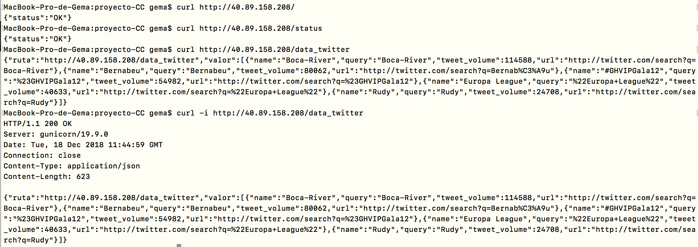

# Script de aprovisionamiento

El script de aprovisionamiento debe llamarse `acopio.sh` y estará situado en el directorio principal. Básicamente, las líneas que hemos visto para la creación de máquina virtuales desde la consola, las juntamos todas y las ponemos en un script, con el fin de automatizar el proceso. A continuación, se explica el [código](https://github.com/Gecofer/proyecto-CC/blob/master/acopio.sh):

1. Creamos el grupo de recursos con la localización en el centro de Francia:

  ~~~
  az group create --name myResourceGroup-francecentre --location francecentral
  ~~~

2. Creamosla máquina virtual con Ubuntu Server 18.04 LTS, indicando el grupo de recursos, el usuario de dicha máquina, la generación de las clases SSH y ponemos la IP a estática. Además, se extrae la IP pública de la máquina y se guarda en la variable.

  ~~~
  IP=$(az vm create --resource-group myResourceGroup-francecentre --admin-username gemazure-francecentre --name ubuntuGemaFranceCentre --location francecentral --image Canonical:UbuntuServer:18.04-LTS:18.04.201812060 --generate-ssh-keys --public-ip-address-allocation static| jq -r '.publicIpAddress')
  ~~~

3. Se modifica el tamaño de la máquina virtual por defecto, con el fin de gastar menos dinero durante el mes, y de obtener una máquina de acuerdo a nuestras necesidades:

  ~~~
  az vm resize --resource-group myResourceGroup-francecentre --name ubuntuGemaFranceCentre --size Standard_B1ms
  ~~~

4. Una vez creada la máquina virtual, mostramos su nombre y su dirección IP.

5. Creamos y abrimos el puerto 80, ya que por defecto no viene.

  ~~~
  az vm open-port --port 80 --resource-group myResourceGroup-francecentre --name ubuntuGemaFranceCentre
  ~~~

6. Realizamos el [provisionamiento con Ansible](https://github.com/Gecofer/proyecto-CC/tree/master/provision/acopio), como vimos en el hito 3. En este caso, solo nos hace falta instalar `pip`, clonar nuestro proyecto y los requerimientos del mismo, ya que lo demás viene instalado por defecto en la máquina.

  ~~~
  ansible-playbook -i "$IP," -b provision/acopio/ansible_playbook.yml --user gemazure-francecentre -v
  ~~~

7. Y por último, nos conectamos a la máquina virtual mediante SSH.

  ~~~
  ssh gemazure-francecentre@$IP
  ~~~

Y para ejecutar el script, solo nos hace falta hacer `sh acopio.sh`. A continuación, se muestra una salida de dicho script, pincha [aquí](https://github.com/Gecofer/proyecto-CC/blob/master/docs/salida-acopio.txt) para ver la salida.

Entonces, ya solo nos queda acceder a la aplicación, y comprobar que funciona:

