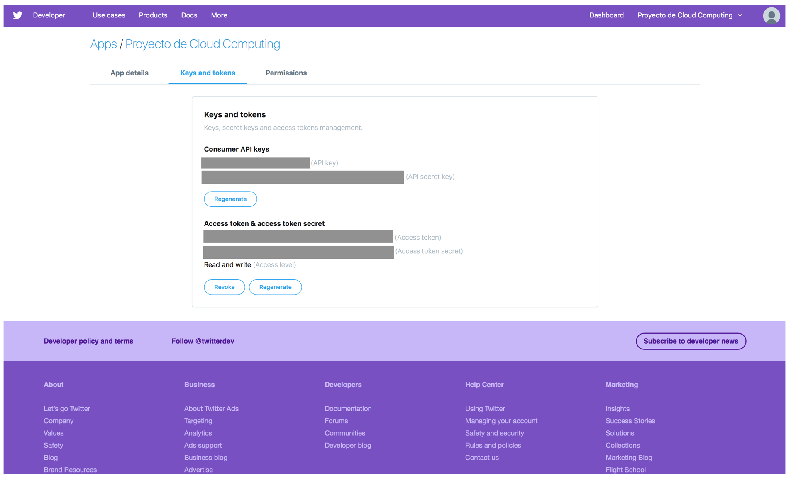
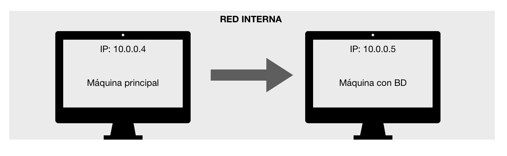
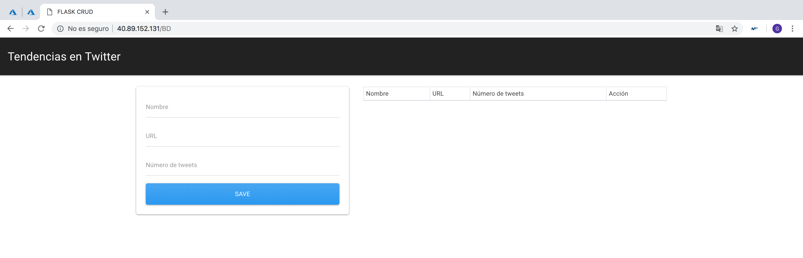
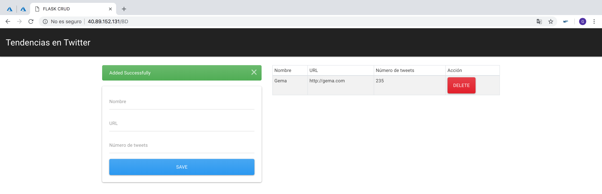
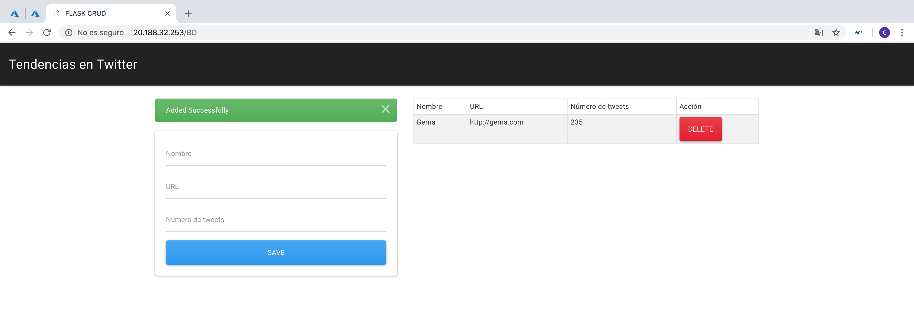
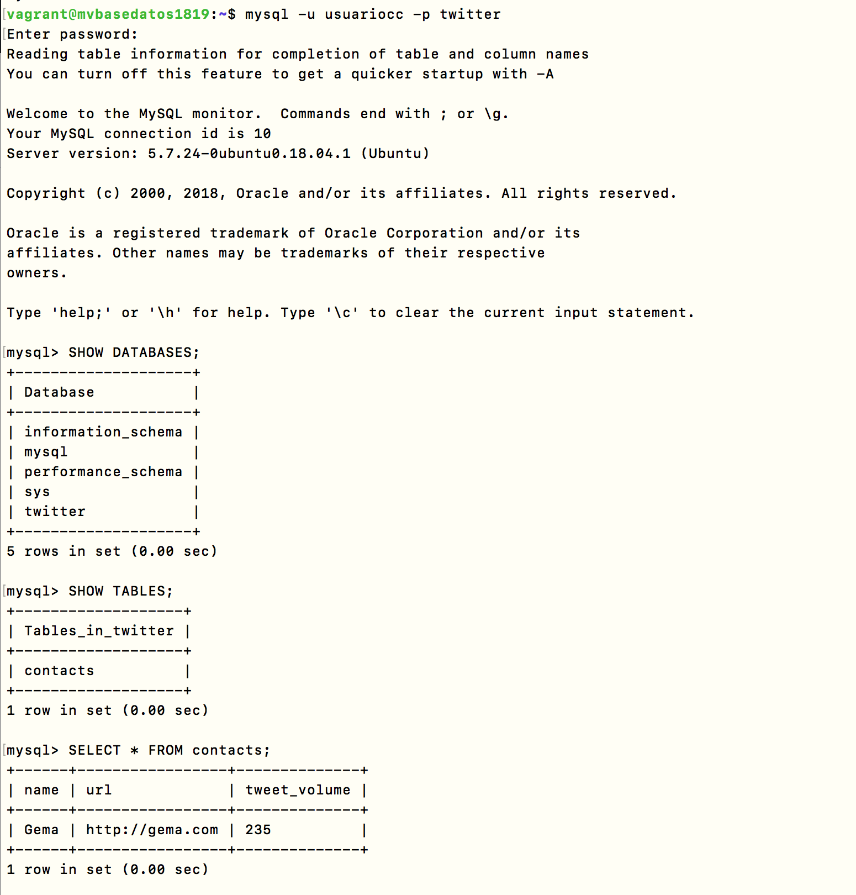

## Documentar avances o mejoras del proyecto

**Tabla de Contenidos**

- [Hito 3](#id0)
  - [Avance 1](#id1)
  - [Avance 2](#id2)
  - [Avance 3](#id3)
  - [Avance 4](#id4)
- [Hito 4](#id5)
  - [Avance 1](#id6)
  - [Avance 2](#id7)
- [Hito 5](#id8)
  - [Avance 1](#id9)
  - [Avance 2](#id10)
  - [Avance 3](#id11)

### Hito 3 

#### Avance 1 

Se ha hecho uso de un conjunto de datos (tendencias) procedentes de la API de Twitter (todo documentado en la [carpeta data](https://github.com/Gecofer/proyecto-CC/tree/master/data)). Para ello, lo primero que hemos hecho ha sido obtener unas claves de acceso para Twitter, las cuales se obtienen accediendo a la página [Twitter Aps](https://apps.twitter.com), creando una nueva app y obteniendo las claves siguientes:

- _Consumer Key (API Key)_
- _Consumer Secret Key (API Secret)_
- _Access Token_
- _Access Token Secret_

Para hacer un uso correcto de estas claves de acceso privadas, es aconsejable ponerlas como variables de entorno en nuestro bash, realizando un export [[1][1]], y en nuestro código `twitterAPI.py` (pincha [aquí](https://github.com/Gecofer/proyecto-CC/blob/master/data/twitterAPI.py) para verlo):

~~~
auth = tweepy.OAuthHandler(environ["TWITTER_CONSUMER_KEY"],
                          environ["TWITTER_CONSUMER_SECRET"])

auth.set_access_token(environ["TWITTER_ACCESS_TOKEN"],
                      environ["TWITTER_ACCESS_TOKEN_SECRET"])
~~~

Una vez que ya tenemos acceso a la API, se realiza la función `API.trends_place(id[, exclude])` [[4][4]], que devuelve las 10 tendencias virales en formato JSON. (_Esta información se almacena en caché durante 5 minutos. Solicitar con frencuencia no devolverá más datos y contará en contra de su límite de uso, es por eso que es aconsejable ralizar pocas solicitudes y guardarlo en un archivo._)

[1]: https://github.com/lauramayol/laura_python_core/blob/b0f62fb70ecef0e8f3d5e8476665a48519dfc44e/week_05/mini_projects/api_from_other_apis/tweet.py

#### Avance 2 

La creación del conjunto de datos obtenidos de la API de Twitter, ha llevado a eliminar el fichero `util.py` y su correspondiente test `util_test.py`, el cual me permitía manejar una estructura de datos sencilla para el desarrollo del hito 2:

~~~
data_twitter = {
    "GR": [
            {
                "name":"Granada",
                "url_twitter":"https://twitter.com/aytogr?lang=es",
                "user_twitter":"@aytogr"
            },
        ]
    ,

    "MDR": [
            {
                "name":"Madrid",
                "url_twitter":"https://twitter.com/madrid",
                "user_twitter":"@MADRID"
            },
        ]
    ,

    "VLC": [
            {
                "name":"Valencia",
                "url_twitter":"https://twitter.com/ajuntamentvlc?lang=es",
                "user_twitter":"@AjuntamentVLC",
            },
        ]
}

# ---------------------------------------------------------------------------- #
# Función que devuelve todos los valores de la variable "data_twitter"
def get_data_twitter():
    return data_twitter
# ---------------------------------------------------------------------------- #
# Función que devuelve uno de los valores de la variable "data_twitter"
def get_id_data_twitter(data):
    if data in data_twitter:
        return data_twitter[data]
    else:
        return False
# ---------------------------------------------------------------------------- #
# Función que modificar uno de los atributos de la variable "data_twitter"
def update_data_twitter(data, name, user):
    if data in data_twitter:
        data_twitter[data][0][name] = user
        return True
    else:
        return False
# ---------------------------------------------------------------------------- #
....
~~~

#### Avance 3 

El fichero `main.py` ha sufrido diversas modificaciones (pincha [aquí](https://github.com/Gecofer/proyecto-CC/blob/master/main.py) para acceder al mismo):

  1. Realizamos una lectura del JSON obtenido en el avance 1:

  ~~~
  try:
    with open('data/data.json', encoding='utf-8') as data_file:
        data_twitter = json.loads(data_file.read())
  except IOError as fail:
    print("Error %d reading %s", fail.errno, fail.strerror)
  ~~~

  2. Para comprobar que se ha desplegado de forma correcta, disponemos de dos rutas:

  ~~~
  @app.route('/')
  @app.route('/status')
  ~~~

  3. La función `get_data(nameID)` creada para visualizar un solo un elemento del JSON (método GET para obtener un recurso del servidor), ha sufrido modificaciones, debido a que en el anterior hito se accedía de la forma `/get_data?id=GR` y ahora se ha modificado a `/data_twitter/<nameID>`, lo que ha llevado una modificación del código.

  4. La función `post_data(nameID)` creada para modificar un elemento del JSON (método POST para actualizar un recurso del servidor), ha sufrido modificaciones, debido a que en el anterior hito se accedía de la forma `/get_data?id=GR` y ahora se ha modificado a `/data_twitter/<nameID>`, lo que ha llevado una modificación del código.

  5. La función `delete_data(nameID)` creada para eliminar un elemento del JSON (método DELETE para eliminar un recurso del servidor), ha sufrido modificaciones, debido a que en el anterior hito se accedía de la forma `/get_data?id=GR` y ahora se ha modificado a `/data_twitter/<nameID>`, lo que ha llevado una modificación del código.

  6. Se ha cambiado la forma de acceder al puerto que por defecto usa Flask, para que en el despliegue en Azure se pueda acceder al puerto 80.

  ~~~
  port = int(os.environ.get("PORT", 5000))
  app.run(host="0.0.0.0", port=port, debug=True)
  #app.run(debug=True, port = 5000)
  ~~~

#### Avance 4 

La modificación del fichero `main.py`, ha supuesto realizar algunos cambios en su fichero de testeo `main_test.py`. Además, se han realizado dos funciones nuevas de test, una de ellas comprueba que Flask ha arrancado bien y la otra comprueba que nos hemos equivocado al escribir la URL. Con ello, lo que estamos haciendo es tener cada vez un código más robusto.

### Hito 3 

#### Avance 1 

Se ha incorporado a nuestro proyecto, un sistema centralizado de logs, que tendremos que tener en cuenta cada vez que creemos o mdodifiquemos un fichero. Un log ("registro", en español) es un archivo de texto en el que constan cronológicamente los acontecimientos que han ido afectando a un sistema informático (programa, aplicación, servidor, etc.), así como el conjunto de cambios que estos han generado [[1][1]]. Básicamente los logs, nos van a permitir tener un mayor control del de la información, con el fin de detectar más rápidamente posibles fallos.

Para este servicio que estamos implementando, utilizaremos la biblioteca de generación de logs de Python ([logging](https://docs.python.org/3.6/library/logging.html)). Este módulo define funciones y clases que implementan un sistema flexible de registro de eventos para aplicaciones y bibliotecas. La ventaja clave de tener la API de registro proporcionada por un módulo de biblioteca estándar es que todos los módulos de Python pueden participar en el registro, de modo que el registro de su aplicación puede incluir sus propios mensajes integrados con mensajes de módulos de terceros.

Dicho registro se registrará en un fichero llamado `debug.log`. Por tanto, vamos a ver las modificaciones hechas en nuestro código:

1. Importamos el módulo.

  ~~~
  import logging
  ~~~

2. Devolvemos un _logger_ con el nombre especificado o, si el nombre es ninguno, devuelve un logger que sea el logger raíz de la jerarquía. Si se especifica, el nombre es típicamente un nombre jerárquico separado por puntos como

  ~~~
  logger = logging.getLogger("app")
  ~~~

3. Se realiza la configuración básica del sistema de registro creando un _StreamHandler_ con un formato predeterminado y añadiéndolo al registrador raíz. Las funciones debug(), info(), warning(), error() y critical() llamarán a basicConfig() automáticamente si no se definen handlers para el registrador raíz. Además, establecemos que nos muestre la traza del nivel de debug() o superior.

  ~~~
  logging.basicConfig(filename= "debug.log", filemode='a', format= '%(asctime)s - %(name)s - %(levelname)s - %(message)s', level=logging.DEBUG)
  ~~~

  Vamos a entender que significan cada uno de los niveles disponibles para identificación de logs [[2][2]]:

  - DEBUG: Información que es diagnósticamente útil para la gente más allá de los desarrolladores (IT, administradores de sistemas, etc.).
  - INFO: Información general útil para registrar (inicio/parada de servicio, supuestos de configuración, etc.). Información que quiero tener siempre disponible, pero que por lo general no me importa en circunstancias normales.
  - WARNING: Cualquier cosa que potencialmente pueda causar rarezas de aplicación, pero para la cual me estoy recuperando automáticamente. (Por ejemplo, cambiar de un servidor primario a un servidor de copia de seguridad, volver a intentar una operación, falta de datos secundarios, etc.).
  - ERROR: Cualquier error que sea fatal para la operación, pero no para el servicio o la aplicación (no se puede abrir un archivo requerido, falta de datos, etc.). Estos errores obligarán al usuario (administrador o usuario directo) a intervenir. Estos son usualmente reservados (en mis aplicaciones) para cadenas de conexión incorrectas, servicios faltantes, etc.
  - FATAL: Cualquier error que obligue a cerrar el servicio o la aplicación para evitar la pérdida de datos (o una mayor pérdida de datos). Me reservo estos sólo para los errores más atroces y las situaciones en las que se garantiza que ha habido corrupción o pérdida de datos.

4. Añadiremos el log con la información que deseemos, como por ejemplo:

  ~~~
  logger.error("404 Not Found: The requested URL was not found on the server - Status 404")
  ~~~

Se debe tener en cuenta, que la creación de un registro conlleva una consistencia, por lo que se deberá siempe seguir la misma estructura para dicho registro. Por tanto, hemos hecho las anteriores modificaciones en los siguientes microservicios:  

- Se han añadido logs a la conexión y descarga de datos procedentes de la API de Twitter como viemos [aquí](https://github.com/Gecofer/proyecto-CC/tree/master/data), con el fin de saber cuando nos conectamos a la API de Twitter y cuando obtenemos los datos. a continuación, se ve una salida:

~~~
2018-12-18 02:19:10,761 - data - INFO - Successfully connected API Twitter.
2018-12-18 02:19:10,761 - tweepy.binder - DEBUG - PARAMS: {'lat': b'37.1833', 'long': b'-3.6'}
2018-12-18 02:19:10,762 - requests_oauthlib.oauth1_auth - DEBUG - Signing request <PreparedRequest [GET]> using client
2018-12-18 02:19:10,762 - requests_oauthlib.oauth1_auth - DEBUG - Including body in call to sign: False
2018-12-18 02:19:11,123 - requests_oauthlib.oauth1_auth - DEBUG - Updated body: None
2018-12-18 02:19:11,124 - urllib3.connectionpool - DEBUG - Starting new HTTPS connection (1): api.twitter.com:443
2018-12-18 02:19:11,463 - urllib3.connectionpool - DEBUG - https://api.twitter.com:443 "GET /1.1/trends/place.json?id=766356 HTTP/1.1" 200 5268
2018-12-18 02:19:11,466 - data - INFO - Successfully obtain location trends.
~~~

- Se ha añadido un sistema de logs a nuestro microservicio de Flask, con el fin de saber nos conectamos, que salidas recibimos. Hay que tener en cuenta que Flask cuenta con su propio sistema de logs, por lo que veremos la salida de los logs creados por nosotros mismos y por Flask:

~~~
2018-12-18 02:23:00,324 - werkzeug - WARNING -  * Debugger is active!
2018-12-18 02:23:00,340 - werkzeug - INFO -  * Debugger PIN: 103-029-300
2018-12-18 02:23:05,350 - app - INFO - Successfully status application in '/' or '/status'
2018-12-18 02:23:05,350 - werkzeug - INFO - 127.0.0.1 - - [18/Dec/2018 02:23:05] "GET / HTTP/1.1" 200 -
2018-12-18 02:23:21,900 - app - INFO - Successfully method GET: The URL shows all the items in '/data_twitter' - Status 200
2018-12-18 02:25:17,907 - app - ERROR - 404 Not Found: The requested URL was not found on the server - Status 404
2018-12-18 02:25:17,908 - werkzeug - INFO - 127.0.0.1 - - [18/Dec/2018 02:25:17] "GET /data_twitt HTTP/1.1" 404 -
~~~

Esta mejora supone un avance sustancial en nuestro servicio, debido a que ahora tenemos un registro de todo nuestro proyecto, con el fin de detectar errores que antes no eran más difíciles de encontrar. Además, la incorporación de un sistema de logs, se puede realizar de muchas maneras, aquí muestro una serie de tutoriales bastantes interesantes:

- [logging — Logging facility for Python](https://docs.python.org/3/library/logging.html)
- [Logging in Python](https://realpython.com/python-logging/)
- [Good logging practice in Python](https://fangpenlin.com/posts/2012/08/26/good-logging-practice-in-python/)
- [Logging en Python (un tutorial frustrado)](https://moduslaborandi.net/post/python-logging/)
- [Logging in Flask](http://flask.pocoo.org/docs/1.0/logging/)
- [Aprende Python en 5 días](https://ricveal.com/blog/curso-python-5/)
- [Logs en Flask](http://lineadecodigo.com/python/logs-en-flask/)

#### Avance 2 

La incorporación de un sistema centralizado de logs, ha llevado a cabo una revisión del código que testea nuestro proyecto. Asimismo como una reestructuración de la documentación disponible en Github.

### Hito 5 

Hasta ahora, siempre hemos usado las tendencias extraídas de la API de Twitter, pero debemos preguntarnos, si esa es la funcionalidad completa que queremos darle a nuestra aplicación. Entonces, llegamos a la conclusión, de que los datos extraídos de la API de Twitter no son modificables, ¿que pasaría si el usuario quiere guardar sus tendencias de Twitter? Para responder a esta pregunta, debemos hacer uso de una base de datos. En donde el usuario puede consultar los datos de twitter en una ruta específica, pero además, puede insertar sus tendencias en otra ruta. Con el fin, de que ambos servicios le sean de utilidad y pueda sacar el máximo provecho a la aplicación.

#### Avance 1 

Como hemos comentado anteriormente, se ha incorporado una base de datos en MySQL con el fin de que el usuario pueda guardar sus tendencias en Twitter. En este caso, se ha hecho uso de MySQL, pero se podría haber usado otra, ahora explicamos el porqué:

1. **PostgreSQL vs MySQL**: MySQL resulta ser un sistema más simple y que busca atraer a desarrolladores que quieren trabajar con un poco más de comodidad, con _queries_ simples y bases de datos pequeñas o medianas. Por otro lado, para quienes buscan más funciones y trabajan con bases muy grandes, PostgreSQL se convierte en el aliado indicado [[3][3]].

2. **MySQL vs MongoDB**: MySQL ofrece alto rendimiento, flexibilidad, protección confiable de datos, alta disponibilidad y es fácil de administrar. Si se indexa correctamente puede mejorar notoriamente el rendimiento, facilitar las consultas y mejorar la robustez. Cabe destacar que es aconsejable si el esquema no cambia y se guardan siempre los mismos datos [[4][4]].

Como vamos a trabajar con bases de datos pequeñas y nuestro esquema no va a cambiar, es por eso que vamos hacer uso de MySQL. Además, Flask cuenta con una base de datos MySQL (ver [aquí](https://flask-mysqldb.readthedocs.io/en/latest/)), la cual nos facilita el trabajo. Por lo que simplemente para la conexión con la base de datos necesitamos:

~~~
# Conexión con MYSQL
app.config['MYSQL_HOST'] = '10.0.0.5'
app.config['MYSQL_USER'] = 'usuariocc'
app.config['MYSQL_PASSWORD'] = ''
app.config['MYSQL_DB'] = 'twitter'
mysql = MySQL(app)
~~~

En donde la dirección IP privada de la máquina con la base de datos es la 10.0.0.5 y en la carpeta [scripts](https://github.com/Gecofer/proyecto-CC/tree/master/scripts) podemos encontrar los scripts para la creación del usuario, la base de datos y la tabla.

Antes de nada, debemos saber que Azure asigna a la primera máquina (la principal) la dirección IP privada 10.0.0.4 y a la segunda (la de la BD) la dirección IP privada 10.0.0.5. Por tanto, hay que tener en cuenta, que la idea es tener una red interna, en donde la máquina virtual que contiene la base de datos esté escuchando a la IP 10.0.0.4, es por eso que en el archivo de configuración de MySQL (`/etc/mysql/mysql.conf.d/mysqld.cnf`), se debe poner lo siguiente:

~~~
# Instead of skip-networking the default is now to listen only on
# localhost which is more compatible and is not less secure.
#bind-address		= 127.0.0.1
bind-address = 10.0.0.4
~~~

Este cambio se realiza automática con el fichero `ansible_basedatos_playbook.yml`:

~~~
- name: Permite la conexión desde cualquier IP
  replace:
    path: /etc/mysql/mysql.conf.d/mysqld.cnf
    regexp: 'bind-address'
    replace: '#bind-address'

- name: Permite la conexión desde la IP con la máquina principal
  lineinfile:
    path: /etc/mysql/mysql.conf.d/mysqld.cnf
    line: 'bind-address = 10.0.0.4'
    insertafter: '#bind-address *.'
~~~

A continuación, en el fichero `main.py`, hemos añadido dos rutas en HTML [[5][5]]:

1. Una ruta para visualizar los datos de la BD que el usuario introduce por pantallla: '/BD'

~~~
# Ruta para visualizar los datos de la BD y la página principal
@app.route('/BD')
def Index():

    # Establecemos la conexión con la BD
    cur = mysql.connection.cursor()
    logger.info("Successfully connection.")
    cur.execute('SELECT * FROM contacts')
    logger.info("Successfully execute SELECT * FROM contacts.")
    data = cur.fetchall()
    cur.close() # cerramos la conexión

    return render_template('index.html', contacts = data,
                            content_type='application/json')
~~~

2. Una ruta para insertar en la base de datos.

~~~
# Ruta para insertar en la BD
@app.route('/add_bd', methods=['POST'])
def add_bd():

    # Como vamos a modificar hacemos uso del método POST
    if request.method == 'POST':
        # Obtenemos las variables a insertar
        name = request.form['name']
        url = request.form['url']
        tweet_volume = request.form['tweet_volume']

        # Establecemos la conexión con la BD
        cur = mysql.connection.cursor()
        logger.info("Successfully connection.")
        cur.execute("INSERT INTO contacts (name, url, tweet_volume) VALUES ( %s,%s,%s)", (name, url, tweet_volume))
        logger.info("Successfully execute INSERT INTO contacts (name, url, tweet_volume).")
        mysql.connection.commit()

        flash('Added Successfully')
        logger.info("Successfully method POST: Added to database.")

        return redirect(url_for('Index'))
~~~

Para comprobar que inserta en la base de datos, simplemente tenemos que dirigirnos a la máquina que contiene la base de datos, acceder a MySQL con `mysql -u usuariocc -p twitter` y mostrar el contenido de la tabla:

Como se puede observar, se ha hecho uso de HTML para el manejo de la BD en el navegador, se pueden comprobar las plantillas [aquí](https://github.com/Gecofer/proyecto-CC/tree/master/html) [[5][5]]:

#### Avance 2 

Se han añadido más _logs_ a la parte de la base de datos, en donde este sistema de centralización nos ha permitido resolver problemas para la conexión con la base de datos:
~~~
logger.info("Successfully connection.")
~~~

#### Avance 3 

Como se ve en las imágenes anteriores, se ha puesto un botón de eliminar, con el fin de deshacer filas en la BD, pero dicha funcionalidad se ha pensado añadirla en el siguiente hito, al igual que se han dejado los tests preparados para introducir más tests relacionados con la base de datos.

[1]: https://dbi.io/es/blog/que-son-los-logs/
[2]: https://stackoverflow.com/questions/2031163/when-to-use-the-different-log-levels
[3]: https://guiadev.com/postgresql-vs-mysql/
[4]: https://guiadev.com/mariadb-vs-mysql-cual-debo-elegir/
[5]: https://github.com/FaztWeb/flask-crud-contacts-app
[6]: https://guiadev.com/mysql-vs-mongodb/
