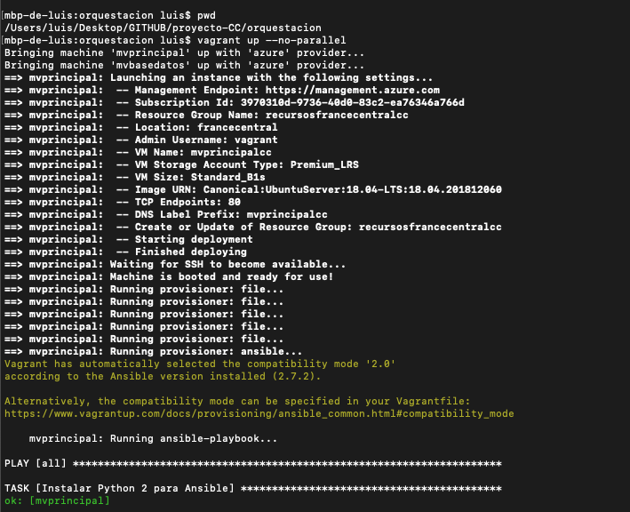
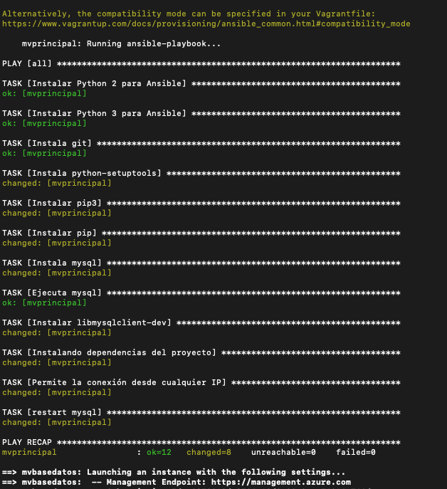
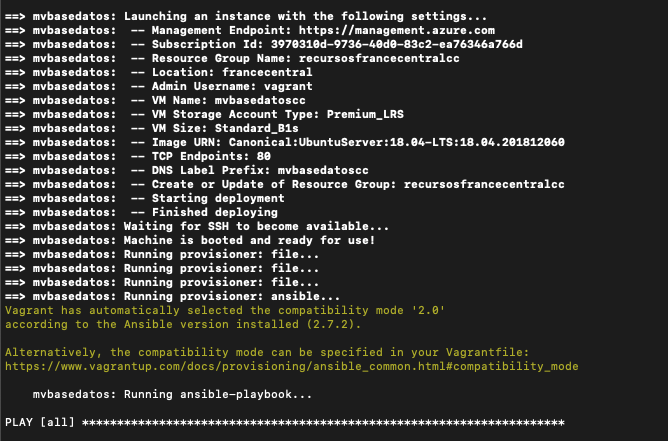
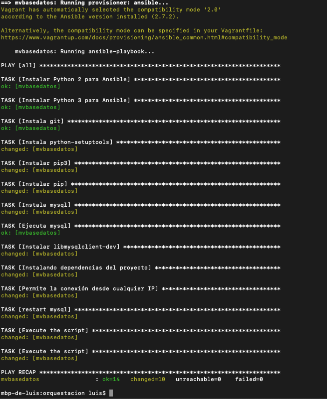
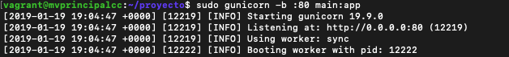
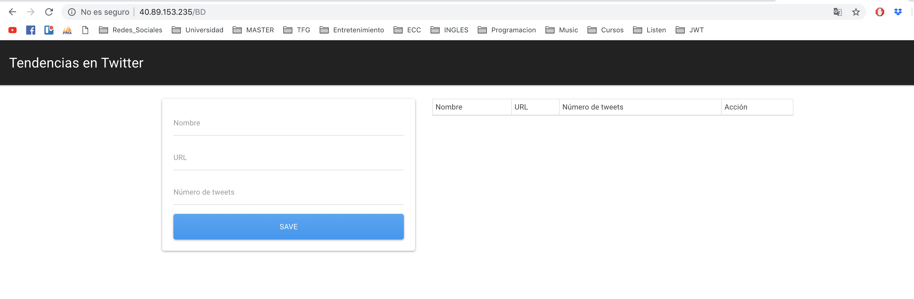
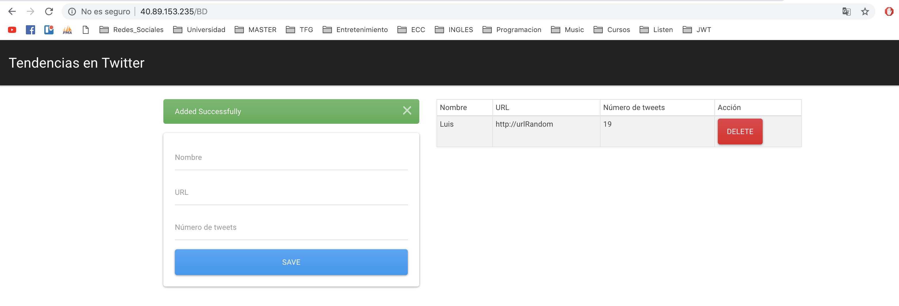

# Prueba de aprovisionamiento a Gema Correa en el hito 5 de Cloud Computing
---

**Autor**: [Luis Gallego Quero](https://github.com/luiisgallego)

Para el proceso de comprobación de la parte de despliegue y provisión del proyecto de Gema he seguido el siguiente recorrido:

Como primer paso lógico se ha clonado su proyecto al completo y se ha accedido a la carpeta correspondiente a la orquestación. Una vez allí, se ha lanzado *Vagrant* para poder hacer uso de las máquinas virtuales mediante la siguiente orden. El resultado lo podemos ver en las siguientes capturas:

~~~
vagrant up --no-parallel
~~~

Como podemos observar, las máquinas estan listas para ser ejecutadas. Por lo tanto, ya podemos acceder a la primera máquina y lanzar la aplicación. Comentar que durante el despliegue la segunda máquina ya está completamente configurada para que el servicio de base de datos funcione correctamente, por lo que no será necesario acceder a dicha máquina.

La aplicación funcionando en la primera máquina lo podemos ver en la siguiente captura:

Ya tan solo faltaría que desde nuestra máquina anfitriona comprobaramos que la aplicación está funcionando correctamente. Para ello necesitamos la ip pública de la máquina principal que obtenemos desde azure. Una vez introducida la ip en el navegador obtenemos lo siguiente:

Por último, también podemos hacer uso de la interfaz gráfica de la que dispone el proyecto, que como veremos más abajo se actualiza correctamente al añadir información en la base de datos.

Como conclusión, podemos afirmar que tanto el despliegue como provisión del proyecto de Gema funciona correctamente.

