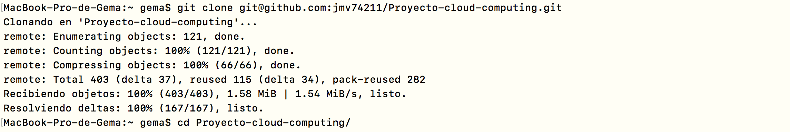
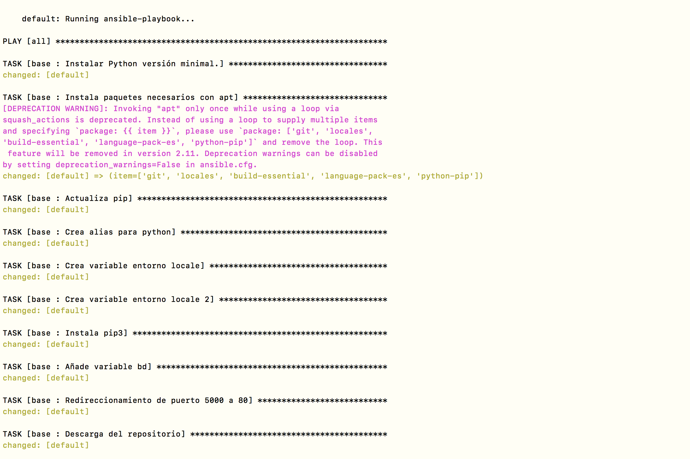
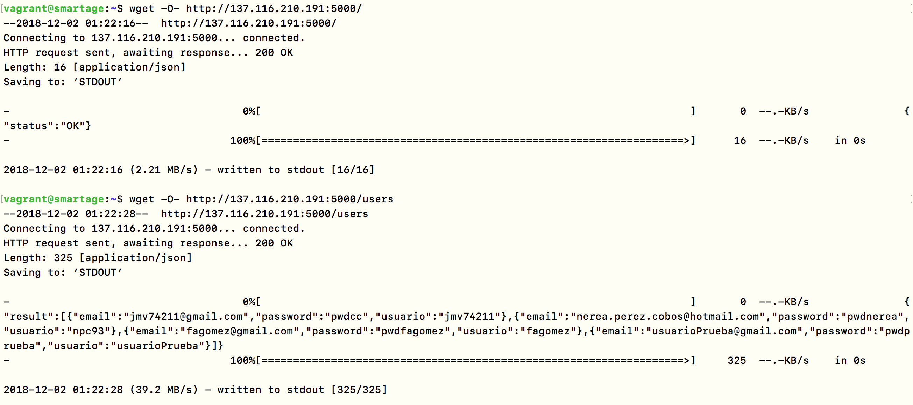

# Comprobación a **[@jmv74211](https://github.com/jmv74211/Proyecto-cloud-computing)** del provisionamiento

---

# Tabla de contenidos

<!-- START doctoc generated TOC please keep comment here to allow auto update -->
<!-- DON'T EDIT THIS SECTION, INSTEAD RE-RUN doctoc TO UPDATE -->
<!-- END doctoc -->

- [Proceso de comprobación en máquina local con vagrant](#id1)
- [Comprobación de la aplicación en azure.](#comprobaci%C3%B3n-de-la-aplicaci%C3%B3n-en-azure)

<!-- END doctoc generated TOC please keep comment here to allow auto update -->

---

# Introducción

Voy a comprobar el provisionamiento realizado por **[@jmv74211](https://github.com/jmv74211/)** para el hito 3 de la asignatura Cloud Computing.

---

# Proceso de comprobación en máquina local con Vagrant 

En primer lugar he realizado un `fork` del repositorio y he clonado dicho fork a mi disco local:

Comprobamos el contenido de dicho repositorio:

A continuación, nos situamos en el directorio de _vagrant_ y lanzamos `vagrant up` para crear la máquina virtual.

Como podemos comprobar en la imagen anterior, se nos descarga una máquina con ubuntu xenial64.

En el proceso de instalación de la máquina virtual tiene programado que se ejecute el script de ansible para aprovisionar la máquina. En la siguiente imagen podemos comprobar que el provisionamiento se realiza correctamente.

Al finalizar el proceso de instalación y aprovisionamiento, podemos comprobar que la máquina creado se está ejecutando.

En la imagen anterior vemos que la máquina que se ha creado llamada vagrant_default_154371269174 se iniciado automáticamente (debido a `vagrant up`).

A continuación, iniciamos sesión con ssh a través de la orden `vagrant ssh`.

Una vez iniciado sesión, procedemos a ejecutar la aplicación. En este momento vamos a comprobar si realmente se ha realizado correctamente el provisionamiento, ya que para ejecutar este proyecto se necesita instalar unas dependencias que supuestamente se han instalado en la fase del provisionamiento con ansible.

Podemos comprobar que la aplicación se ha lanzado correctamente sin ningún problema. Entonces, podemos concluir que **EL APROVISIONAMIENTO SE HA REALIZADO CON ÉXITO**.

---

# Comprobación de la aplicación en Azure

[@jmv74211](https://github.com/jmv74211/) ha desplegado dicha aplicación en el sistema cloud Azure. Dicho usuario ha ejecutado el mismo playbook de ansible que el que he comprobado en la máquina virtual de vagrant, por lo que podemos afirmar que se ha realizado el mismo proceso de aprovisionamiento y se puede decir que **EL APROVISIONAMIENTO SE HA REALIZADO CON ÉXITO**.

Vamos a comprobar que el servicio realmente está disponible y devuelve la respuesta a las peticiones enviadas.

