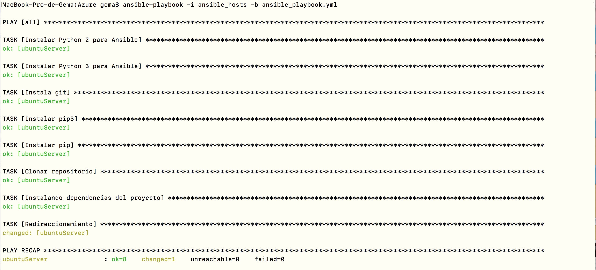
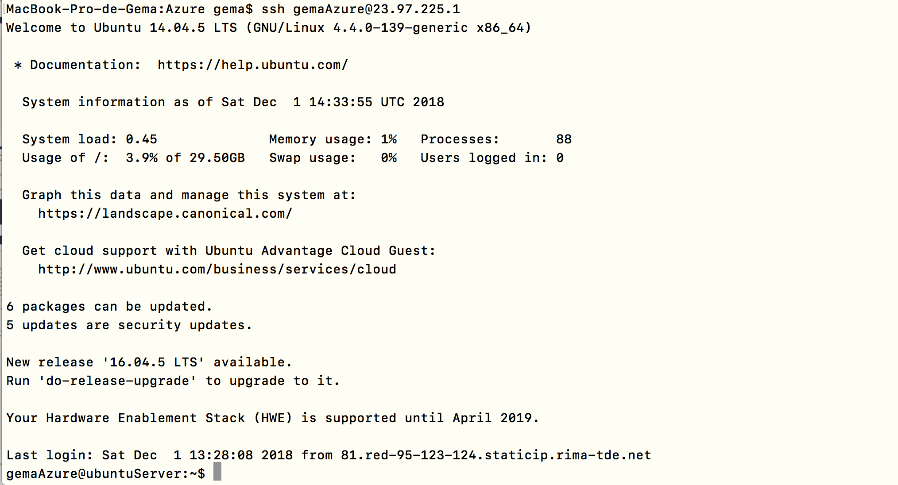

# Análisis de tendencias (geolocalizadas) en Twitter

**Tabla de Contenidos**

- [Novedades](#id0)
- [Descripción del proyecto](#id1)
- [Descripción de arquitecturas software](#id2)
  - [Arquitectura seleccionada](#id3)
- [Descripción de los microservicios a desarrollar](#id4)
  - [Comunicación entre los microservicios](#id5)
- [Bibliotecas de Python para la API de Twitter](#id6)
  - [Descipción de los tests en Python (código sin test código roto)](#id7)
- [Descripción del despliegue](#id8)
  - [Despliegue en PaaS](#id9)
    - [Rutas utilizadas en la aplicación](#id10)
    - [Descripción de los ficheros usados](#id11)
    - [Pasos para hacer el despliegue (Github+Travis+Heroku)](#id12)
  - [Despliegue de la infraestructura en máquina virtual local](#id13)
    - [Vagrant](#id14)
    - [Ansible](#id15)
  - [Despliegue de la infraestructura en Azure](#id16)
- [Enlaces de Interés](#id17)
- [Licencia](#id18)

## Novedades 

- Pincha [aquí](https://github.com/Gecofer/proyecto-CC/blob/master/docs/errores_proyecto.md) para acceder a los errores solucionados a lo largo del hito 3.
- Pincha [aquí](https://github.com/Gecofer/proyecto-CC/blob/master/docs/avance_proyecto.md) para acceder a los avances realizados en el hito 3.
- Pincha [aquí](https://github.com/Gecofer/ejercicios-CC) para acceder a los ejercicios de la asignatura (resúmenes de charlas, ejercicios, enlaces de interés...).
- Pincha [aquí](https://github.com/Gecofer/proyecto-CC/tree/master/provision) para ver el despliegue realizado en una máquina local y en Azure.
- Pincha [aquí](#id14) para ver las comprobaciones de provisionamiento del hito 3 entre [@jmv74211](https://github.com/jmv74211/) y [@gecofer](https://github.com/Gecofer).
- Pincha [aquí](https://github.com/Gecofer/ejercicios-CC/blob/master/hito3/Charla%20logs/logs.md) para ver el resumen realizado de la charla impartida sobre `logs`.
- Pincha [aquí](https://github.com/Gecofer/ejercicios-CC/blob/master/hito3/pyenv.md) para ver como se ha puesto un _environment_ a la carpeta del proyecto de la asignatura.

## Descripción del proyecto 

Twitter junto con Instagram son dos de las plataformas sociales más usadas actualmente, por eso mismo, miles de usuarios comparten todo tipo de información en ellas. Este tipo de comportamientos benefician a las empresas dándoles potestad en la obtención de información muy valiosa, cómo por ejemplo ver qué tendencias o _trending topics_ son los más comentados o qué ciudades son las más comentadas en la red. En este caso, yo me voy a centrar en la obtención de datos geolocalizados, es decir,  en la extracción de _trending topics_ o tendencias de los usuarios en Twitter para una región determinada. Para así, poder clasificar las tendencias y establecer la tendencia mayoritaria para una region determinada.

## Descripción de arquitecturas software 

Actualmente, las arquitecturas software modernas buscan la consistencia en la velocidad de respuesta al usuario. Sin embargo, en el mercado existen muchos tipos de arquitecturas, es por ello que a veces se hace difícil concretar qué arquitectura se va a utilizar [[2][2]]:

- __Arquitectura en capas__: arquitectura cliente-servidor, tiene 3 o más capas, normalmente se suelen incluir la capa de presentación, la de aplicación, la de lógica de negocio y la de acceso a datos. El problema principal es que solo permite escalado dentro de cada una de las capas, siendo al final alguna de ellas un cuello de botella.
- __Arquitectura dirigida por eventos__: tiene una cola de eventos que se originan en el usuario, pero también de una parte a otra de la arquitectura. Es difícil de testear y su desarrollo es más complicado que la anterior.
- __Arquitectura microkernel__: arquitectura casi monolítica, con un núcleo central al que se pueden añadir funcionalidades mediante _plugins_, siendo su problema principal la escalabilidad, ya que el núcleo puede representar un cuello de botella.
- __Arquitectura basada en microservicios__: arquitectura muy popular, se caracteriza por usar unidades que se van a desplegar de forma independiente y por poder usar tecnologías subyacentes que van desde la virtualización completa en la nube hasta el uso de contenedores _Docker_ en una sola máquina virtual.
- __Arquitectura basada en espacios__: arquitectura antigua, de la década de los 90.

### Arquitectura seleccionada 

Entonces, resulta bastante claro que de todas las arquitecturas comentadas anteriormente vayamos a hacer uso de la __arquitectura basada en microservicios__, ya que es la que más actual y la que menos problemas presenta, además de que nos permite tener diferentes servicios trabajando de forma totalmente independiente unos de otros.

## Descripción de los microservicios a desarrollar 

  

Para realizar la arquitectura se va a hacer uso del lenguaje [Python](https://www.python.org), y para el desarrollo de los microservicios se puede usar cualquier microframework web para Python, en este caso existe la posibilidad de usar [Django](https://www.djangoproject.com) (más complejo o pensado para un proyecto de grandes dimensiones o que crezca) o [Flask](http://flask.pocoo.org) (más sencillo). Es por ello, que tras haber buscado documentación, hablado con usuarios de ambos microframework y ser la primera vez que uso este tipo de tecnología, me he decantado por Flask. Los microservicios previstos a desarrollar son los siguientes:

1. __Consultar API de Twitter__: en este microservicio solo nos vamos a centrar en acceder, consultar y bajarnos información de la API, información obtenida en un [JSON](https://www.json.org).
2. __Procesar información__: en este microservicio vamos a quedarnos con los datos referentes a las tendencias según su localización, en un JSON: [`API.trends_place(id[, exclude])`](http://docs.tweepy.org/en/v3.5.0/api.html).
3. __Almacenar información__: en este microservicio nos vamos a centrar en crear una estructura para los datos que hemos realizado, usando principalmente una BD como [MongoDB](https://www.mongodb.com/es).
4. __Mostrar información__: en este microservicio solo nos interesa mostrar la información relevante de alguna manera específica.
5. Además, necesitamos un sistema de centralización de [__logs__](https://www.elastic.co/products/logstash), al cual todos deben comunicarse.

  

### Comunicación entre los microservicios 

La comunicación entre servicios será realizada por _brokers_, en concreto con [RabbitMQ](https://www.rabbitmq.com), que es un sistema de manejo de colas.

## Bibliotecas de Python para la API de Twitter 

Actualmente, la API de Twitter nos permite acceder a todo tipo de información de forma más simple que la de Instagram, es por eso que me he decantado por esta red social. A continuación, se muestran algunos datos a los que podemos acceder [[1][1]]:

- __Tweets__: búsqueda, publicación, filtrado, etc.
- __Anuncios__: gestión de campañas, análisis, etc.
- __Contenido multimedia__: subir y acceder a fotos, vídeos, GIF animados, etc.
- __Tendencias__: _trending topics_.
- __Geo__: información sobre lugares conocidos, lugares cerca de una ubicación, etc.

Python cuenta muchas bibliotecas desarrolladas para la API de Twitter. Sin embargo, al no haber usado nunca ninguna me es dífil elegir que biblioteca es la mejor. Es por ello, que voy hacer uso de [tweepy](https://github.com/tweepy/tweepy) ya que he oído hablar de ella bastante bien y tiene bastante documetación en la web. De todas maneras, existen otras librerías cómo [twython](https://github.com/ryanmcgrath/twython), [python-twitter](https://github.com/bear/python-twitter) o [TwitterAPI](https://github.com/geduldig/TwitterAPI).

### Descipción de los tests en Python (código sin test código roto) 

Para testear en Python [[3][3]], puedo usar algunas de las librerías que me permiten implementar pruebas unitarias en dicho lenguaje como [unittest](https://docs.python.org/3.5/library/unittest.html), [doctest](https://docs.python.org/3.5/library/doctest.html) o [pytest](https://docs.pytest.org/en/latest/) [[4][4]]. En este caso yo voy hacer uso de la biblioteca [unittest](https://docs.python.org/3.5/library/unittest.html), ya que nos ofrece toda la potencia del lenguaje para probar nuestros programas, lo que significa que ayuda a determinar rápidamente el impacto de cualquier modificación en el resto del código.

Para realizar la configuración de los test correctamente, voy hacer uso de [Travis CL](https://www.travis-ci.org), que es un sistema distribuido de generación e integración continua libre, que me permite conectar mi repositorio de Github y testear después de cada push que haga [[5][5]] [[6][6]]. En el apartado siguiente, explico como establecer el testeo con travis, cuando quiero desplegar.

Por tanto, para establecer un testeo cada vez que haga `git push`, he seguido el [tutorial de Travis](https://docs.travis-ci.com/user/tutorial/).

  

Para testear el archivo `main.py`, me he creado un archivo `main_test.py`, en el cual me he creado 8 funciones que comprueban el código, haciéndolo robusto:

1. Testear ejecución de Flask lanzada.
2. Testear que se ha desplegado correctamente.
  ~~~
  # Testear que se ha desplegado correctamente
  def test1_index(self):
    # result = requests.get('http://127.0.0.1:5000/')
    result = self.app.get("/")
    self.assertEqual(result.status_code, 200)
    self.assertEqual(result.content_type, "application/json")

    pass
  ~~~
3. Testear que se ha desplegado incorrectamente.
4. Testear que se visualizan todos los elementos.
5. Testear que se visualiza uno de los elementos.
  ~~~
  # Testear que se visualiza uno de los elementos
  def test4_get_data(self):
    result = self.app.get("/data_twitter/Rudy")
    self.assertEqual(result.status_code, 200)
    self.assertEqual(result.content_type, "application/json")
    self.assertTrue(result.get_json(), "The list is empty")

    # Escribimos la ruta mal
    result_bad = self.app.get("/hola")
    self.assertEqual(result_bad.status_code, 404)

    pass
  ~~~
6. Testear que se crea un elemento.
7. Testear que se modifica un elemento.
8. Testear que se elimina un elemento.
  ~~~
  # Testear que se elimina un elemento
  def test7_delete_data(self):
    result_delete = self.app.delete("/data_twitter/hola")
    self.assertEqual(result_delete.status_code, 200)
    self.assertEqual(result_delete.content_type, "application/json")
    self.assertTrue(result_delete.get_json(), "The list is empty")

    result_post1 = self.app.post("/data_twitter/#GHVIPGala12")
    result_delete1 = self.app.delete("/delete_data/#GHVIPGala12")
    result_post2 = self.app.post("/data_twitter/#GHVIPGala12")
    self.assertEqual(result_post2.status_code, 404)

    pass
  ~~~

## Descripción del despliegue 

### Despliegue en PaaS 

Cuando se quiere desplegar una aplicación sobre una infraestructura ya definida y que no va a cambiar se necesita un _Platform as a Service_ o PaaS. Entre los posibles servicios que hay [Heroku](https://www.heroku.com) o [OpenShift](https://www.openshift.com), vamos a escoger [Heroku](https://www.heroku.com), ya que es un servicio fiable, gratuito, ofrece muchas opciones a la hora de elegir el lenguaje y permite integrar Github con Travis.

Despliegue: [https://glacial-castle-84194.herokuapp.com](https://glacial-castle-84194.herokuapp.com)

#### Rutas utilizadas en la aplicación 

- `/` y `/status`: devuelve el JSON {"status":"OK"}
  - [https://glacial-castle-84194.herokuapp.com](https://glacial-castle-84194.herokuapp.com)
  - [https://glacial-castle-84194.herokuapp.com/status](https://glacial-castle-84194.herokuapp.com/status)

- `error en la ruta`: devuelve el JSON {"msg error":"URL not found"}
  - [https://glacial-castle-84194.herokuapp.com/get](https://glacial-castle-84194.herokuapp.com/get)

- `/data_twitter`: lista todos los elementos del JSON
  - [https://glacial-castle-84194.herokuapp.com/data_twitter](https://glacial-castle-84194.herokuapp.com/data_twitter)

- `/data_twitter/Rudy`: lista todos los elementos del JSON
  - [https://glacial-castle-84194.herokuapp.com/data_twitter/Rudy](https://glacial-castle-84194.herokuapp.com/data_twitter/Rudy)

- `/data_twitter` con PUT: crea un nuevo usuario del JSON
  ~~~
  curl -i -X PUT https://glacial-castle-84194.herokuapp.com/data_twitter
  # para comprobar que se ha creado
  curl -i https://glacial-castle-84194.herokuapp.com/data_twitter/newID
  ~~~

- `/data_twitter` con POST: modifica un nuevo usuario del JSON
  ~~~
  curl -X POST https://glacial-castle-84194.herokuapp.com/data_twitter/Rudy
  ~~~

- `/data_twitter` con DELETE: elimina un usuario del JSON
  ~~~
  curl -X DELETE https://glacial-castle-84194.herokuapp.com/data_twitter/Rudy
  ~~~

#### Descripción de los ficheros usados 

- `main.py`: fichero que implementa la clase API REST haciendo uso del microframework Flask

- `test/main_test.py`: fichero que testea la clase del _main.py_

- `data/twitterAPI.py`: fichero que se conecta a la API de Twitter y extrae información

- `data/data_json`: fichero que contiene la estructura de datos
  - *name*: nombre de la tendencia
  - *url*: link del enlace de la tendencia
  - *query*: nombre de la consultas
  - *tweet_volume*: volumen de tweets dedicados a esa tendencia

#### Pasos para hacer el despliegue (Github+Travis+Heroku) 

1. Identificarse en Travis mediante Github.

2. Añadir un archivo __[.travis.yml](https://github.com/Gecofer/proyecto-CC/blob/master/.travis.yml)__ al repositorio para decirle a Travis CI qué hacer, el cual contiene:

  - El lenguaje del programación y la versión usada. En este caso he hecho uso de Python 3.7.0 para OSX.
  - El comando para instalar las dependencias, el cual contiene las dependencias a instalar.
  - El comando para ejecutar los tests.

    ~~~
    language: python
    python:
    - "3.7-dev"
    install:
    - pip install -r requirements.txt
    script:
    - python3 test/main_test.py
    ~~~

3. Habilitar el repositorio en Travis, para así cada vez que se haga `git push` se compilen en Travis. Para ello, una vez iniciado sesión en Travis mediante Github, tengo que seleccionar la pestaña del repositorio que quiero ejecutar.

  

4. Crear cuenta en Heroku.

5. Instalar el comando de [Heroku Command Line Interface (CLI)](https://devcenter.heroku.com/articles/getting-started-with-python#set-up). _Como anotación comentar que cada semana actualizan la versión._

6. Identificarse introduciendo nuestras credenciales de la cuenta de Heroku: `heroku login`

7. Para que Heroku pueda encontrar el archivo principal del proyecto, debemos definirnos un archivo __Procfile__ en Heroku [[7][7]], el cual especifica los comandos que son ejecutados por la aplicación al inicio, que contendrá la siguiente instrucción `web: gunicorn main:app`, usaremos [gunicorn](https://gunicorn.org) ya que nos permite administrar las peticiones simultaneas que nuestra aplicación reciba. El archivo debe estar en el directorio raíz de tu app.

  ~~~
  web: gunicorn main:app
  ~~~

8. Creo el fichero __requirements.txt__, para instalar las dependencias. Este fichero se puede instalar de diversas formas, no es recomendable usar  `pip freeze > requirements.txt`, ya que te mete basura [[8][8]]. Debemos recordar añadir _gunicorn_. Para ello hacer uso de [pyenv](https://github.com/Gecofer/ejercicios-CC/blob/master/hito3/pyenv.md).

  ~~~
  Flask==1.0.2
  requests==2.20.1
  gunicorn==19.9.0
  ~~~

9. Crear el fichero __runtime.txt__, en mi caso la versión de Python 3.7.0.

  ~~~
  python-3.7.0
  ~~~

10. Crear una aplicación en Heroku, este proceso se puede hacer de dos maneras: por terminal `heroku create` o mediante la web _Create new App_.

11. Configuar el despliegue automático asociando la aplicación de Heroku con nuestra cuenta de GitHub.
  * En web, accedemos a la aplicacion creada y buscamos _Deploy_
  * Seleccionamos GitHub como _Deployment method_
  * Conectamos la app en introduciendo nuestra datos de GitHub
  * Indicamos el repositorio de GitHub de nuestra aplicación
  * Activamos los despliegues automáticos y que Travis ejecute antes de desplegar.

  

    
  

11. `git push heroku master`: solo para Heroku.

12. `git push`: para Github+Travis+Heroku.

### Despliegue de la infraestructura en máquina virtual local 

Para el despliegue de la aplicación en una máquina virtual local, se ha hecho uso de Ansible junto con Vagrant. Previamente a la realización de un `clone` a mi repositorio, se debe instalar [Ansible](https://github.com/Gecofer/proyecto-CC/tree/master/provision),  [Vagrant](https://github.com/Gecofer/proyecto-CC/tree/master/provision/vagrant-ubuntu) y [VirtualBox](https://www.virtualbox.org), herramientas necesarias para ejecutar la aplicación. Una vez realizados estos procesos, debemos dirigirnos al directorio `provision > vagrant_ubuntu` y ejecutar la sentencia `vagrant up`, la cual creará una máquina virtual en VirtualBox y ejecutará el _playbook_ con lo indispensable para el despliegue.

#### Vagrant 

Se ha utilizado la herramienta Vagrant para generar entornos de desarrollo reproducibles y compartibles de forma muy sencilla, ya que crea y configura máquinas virtuales a partir de simples ficheros de configuración. El fichero donde se describe la infraestructura se llama `Vagrantfile` y es utilizado para el despliegue ([enlace](https://github.com/Gecofer/proyecto-CC/blob/master/provision/vagrant-ubuntu/Vagrantfile)).

_**Pincha [aquí](https://github.com/Gecofer/proyecto-CC/tree/master/provision/vagrant-ubuntu), para saber más información sobre el despliegue en máquina virtual local con Vagrant.**_

#### Ansible 

Para el provisionamiento se ha hecho uso de Ansible (versión 2.7.2)
Como software para automatizar el proceso de aprovisionamiento se ha utilizado Ansible, creando previamente los siguientes ficheros:

- [**ansible.cfg**](https://github.com/Gecofer/proyecto-CC/blob/master/provision/vagrant-ubuntu/ansible.cfg): fichero de configuración básica, que básicamente le dice a Ansible que tiene que mirar en el fichero ansible_hosts.
- [**ansible_hosts**](https://github.com/Gecofer/proyecto-CC/blob/master/provision/vagrant-ubuntu/ansible_hosts): fichero para definir una serie de requerimentos (nombre de la máquina, puerto SSH para acceder a la máquina virtua, host).
- [**ansible_playbook.yml**](https://github.com/Gecofer/proyecto-CC/blob/master/provision/vagrant-ubuntu/ansible_playbook.yml): fichero para definir las intrucciones a ejecutar (python, git, pip, flask, clonar repositorio).

_**Pincha [aquí](https://github.com/Gecofer/proyecto-CC/tree/master/provision), para saber más información sobre la gestión de configuraciones con Ansible.**_

Si no se utiliza Vagrant, también se puede realizar el provisionamiento utilizando órdenes de ansible, es decir, haciendo uso de la orden `ansible-playbook ansible_playbook.yml`.

### Despliegue de la infraestructura en Azure  

Se ha creado una máquina virtual en Azure con Ubuntu 14.04 LTS, la misma usada para el despliegue en la máquina virtua local. Para lanzar la aplicación, debemos conectar a la mv `ssh gemaAzure@23.97.225.1` y ejecutar el provisionamiento que con todos los módulos necesarios se uso de `ansible-playbook -i ansible_hosts -b ansible_playbook.yml`.

Lanzamos nuestra aplicación con [_gunicorn_](https://gunicorn.org) y efectivamente comprobamos que podemos aceder:

La dirección IP: 23.97.225.1

MV: [http://23.97.225.1](http://23.97.225.1)

_**Pincha [aquí](https://github.com/Gecofer/proyecto-CC/tree/master/provision/Azure), para saber más información sobre el despliegue en Azure.**_

## Enlaces de Interés  

- [Publics APIs](https://github.com/toddmotto/public-apis#books)

## Licencia 

Proyecto bajo licencia [GNU GLP V3](https://github.com/Gecofer/proyecto-CC/blob/master/LICENSE).

[1]: https://stackabuse.com/accessing-the-twitter-api-with-python/
[2]: https://github.com/JJ/CC/blob/master/documentos/temas/Arquitecturas_para_la_nube.md
[3]: https://github.com/JJ/tests-python
[4]: https://recursospython.com/guias-y-manuales/unit-testing-doc-testing/
[5]: https://www.smartfile.com/blog/testing-python-with-travis-ci/
[6]: https://github.com/softwaresaved/build_and_test_examples
[7]: https://devcenter.heroku.com/articles/getting-started-with-python
[8]: https://www.idiotinside.com/2015/05/10/python-auto-generate-requirements-txt/

__Nota__: _Se debe tener en cuenta que la realización de un proceso de desarrollo conlleva modificaciones en el futuro, pudiendo modificar la documentación o añadiendo nuevas funcionalidades._
