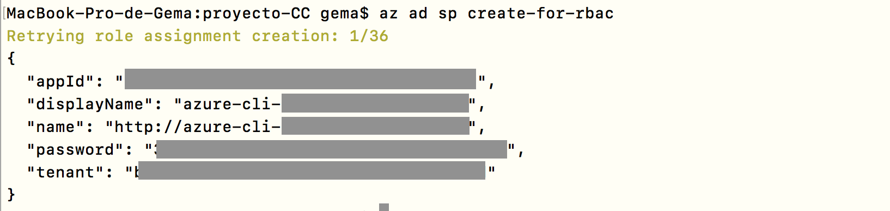
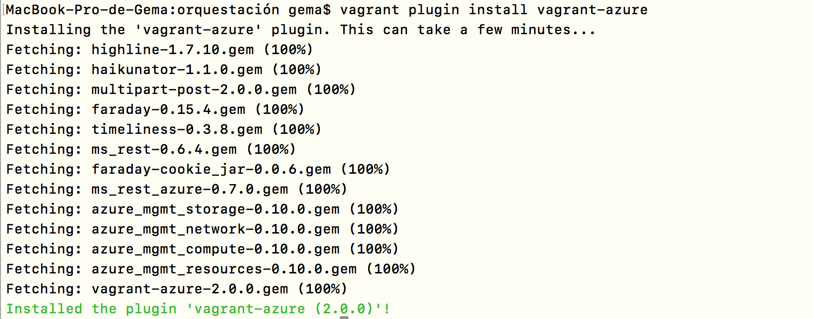
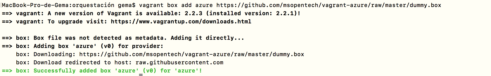
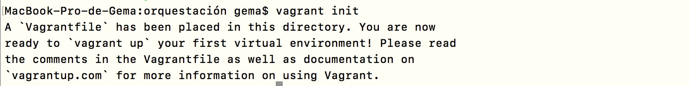
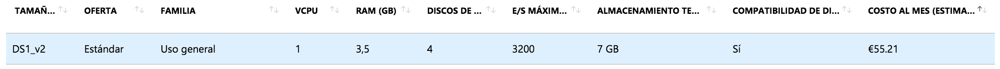
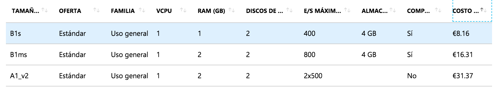

# Orquestación con Vagrant

En este hito se trata de usar `Vagrant` para provisionar una o preferiblemente varias máquinas virtuales usando un proveedor de servicios cloud, en este caso se ha usado Azure.

**Tabla de Contenidos**

- [Comprobando la instalación Vagrant](#id0)
- [Comprobando la instalación CLI de Azure](#id1)
- [Integración de Vagrant con Azure](#id2)
  - [Crear una aplicación de Azure Active Directory (AAD)](#id3)
  - [Creación del archivo Vagrantfile](#id4)
    - [Elementos del archivo Vagrantfile](#id5)
- [Explicación de los playbook usados para el aprovisionamiento](#id6)

## Comprobando la instalación Vagrant 

Lo primero que tenemos que hacer es comprobar que Vagrant está instalado, para ello hacer `vagrant --version`. Si este no es el caso dirigirse al siguiente [enlace](https://github.com/Gecofer/proyecto-CC/tree/master/provision/vagrant-ubuntu) en donde explico la instalación de Vagrant para provisionar una máquina virtual de manera local. En mi caso, dispongo de la versión 2.2.1.

~~~
$ vagrant --version
Vagrant 2.2.1
~~~

## Comprobando la instalación CLI de Azure 

El segundo paso a realizar, es comprobar que está instalado la CLI de Azure. Debido a que Azure nos permite la creación de máquinas virtuales desde el panel de control, pero también desde la línea de órdenes. En nuestro caso, haremos uso de la línea de órdenes, para ello, lo primero que tenemos que hacer es instalarlo. Para la plataforma macOS, se puede instalar la CLI de Azure mediante el administrador de paquetes de Homebrew (se puede ver el proceso en el siguiente [enlace](https://github.com/Gecofer/proyecto-CC/blob/master/docs/automatizar-creacion-mv.md#id2)):

~~~
# Actualizar la información del repositorio de Homebrew
$ brew update

# Instalar la CLI de Azure
$ brew install azure-cli
~~~

Ya solo nos queda comprobar que la instalación ha sido un éxito con `az --version`. En mi caso, dispongo de la versión 2.0.52.

~~~
$ az --version
azure-cli (2.0.52)

...

Python location '/Library/Frameworks/Python.framework/Versions/3.6/bin/python3'
Extensions directory '/Users/gema/.azure/cliextensions'

Python (Darwin) 3.6.7 (v3.6.7:6ec5cf24b7, Oct 20 2018, 03:02:14)
[GCC 4.2.1 Compatible Apple LLVM 6.0 (clang-600.0.57)]

Legal docs and information: aka.ms/AzureCliLegal
~~~

Una vez instalado, pasamos al inicio de sesión (`az login`), todo este proceso está explicado en este [enlace](https://github.com/Gecofer/proyecto-CC/blob/master/docs/automatizar-creacion-mv.md#id4).

## Integración de Vagrant con Azure 

Una vez que tenemos en nuestra máquina Vagrant y Azure CLI, ya podemos pasar a realizar la integración de Vagrant con Azure. Para ello, tenemos que instalar **Vagrant Azure Provider**, el cual es un plugin de Vagrant que añade el proveedor Microsoft Azure a Vagrant, permitiendo así a Vagrant controlar y aprovisionar máquinas en Azure. Para la realización de este proceso, se ha seguido el siguiente [tutorial](https://github.com/Azure/vagrant-azure):

### Crear una aplicación de Azure Active Directory (AAD) 

AAD es una combinación de aplicación/servicio principal que proporciona una identidad de servicio para que Vagrant administre nuestra suscripción a Azure. Así que, una vez instalado Azure CLI e iniciado sesión:

1. Creamos una aplicación de Azure Active Directory con acceso a Azure Resource Manager para la suscripción actual a Azure. Con el fin de obtener los siguientes datos que usaremos más adelante:
~~~
$ az ad sp create-for-rbac
~~~

  

  Los valores `tenant`, `appId` y `password` se asignan a los valores de configuración `azure.tenant_id`, `azure.client_id` y `azure.client_secret` en el archivo Vagrantfile o por variables de entorno. En mi caso, voy hacer uso de variables de entorno para exportar los datos obtenidos previamente, con el fin de obtener más seguridad.

  ~~~
  $ export AZURE_TENANT_ID=xxxxxxxxxxxxxxxxxxxxxxxxxx
  $ export AZURE_SUBSCRIPTION_ID=xxxxxxxxxxxxxxxxxxxxxxxxx
  $ export AZURE_CLIENT_ID=xxxxxxxxxxxxxxxxxxxxxxxxx
  $ export AZURE_CLIENT_SECRET=xxxxxxxxxxxxxxxxxxxxxxxxx
  ~~~
  - azure.tenant_id identifica al usuario de Azure
  - azure.subscription_id identifica a la suscripción utilizada por el usuario
  - azure.client_id identifica al servicio que permite la orquestación
  - azure.client_secret identifica la contraseña para usar ese servicio

2. Obtenemos el identificador de la suscripción a Azure con:
~~~
$ az account list --query "[?isDefault].id" -o tsv
~~~

### Creación del archivo Vagrantfile 

Nos creamos una carpeta llamada _orquestacion_ y accedemos a ella:

~~~
$ mkdir orquestacion
$ cd orquestacion
~~~

Una vez dentro nos instalamos el plugin de Azure para Vagrant, como se especifica en el reposotorio de [Azure en vagrant-azure](https://github.com/Azure/vagrant-azure):

~~~
$ vagrant plugin install vagrant-azure
~~~

A continuación, pasamos a a configurar nuestro [box](https://www.vagrantup.com/intro/getting-started/boxes.html). En donde, en el repositorio de [Azure](https://github.com/Azure/vagrant-azure) se ofrece _box dummy_ con el fin de obtener el esqueleto del archivo Vagrantfile. Se debe lanzar el siguiente comando para solicitar el _box_ [[1][1]]:

~~~
$ vagrant box add azure https://github.com/msopentech/vagrant-azure/raw/master/dummy.box
~~~

Ya solo nos queda obtener el archivo necesario para configurar nuestro proyecto:

~~~
$ vagrant init
~~~

#### Elementos del archivo Vagrantfile 

Una vez que tenemos la estructura de nuestro fichero, pasamos a la creación y configuración de las máquinas virtuales. En nuestro caso, vamos a tener dos máquinas virtuales, en donde una contendrá nuestro servicio y en la otra estarán los datos alojados para la base de datos.

**_Pincha [aquí](https://github.com/Gecofer/proyecto-CC/blob/master/orquestacion/Vagrantfile) para ver el archivo Vagrantfile._**

A continuación, vamos a explicar cada uno de los elementos que se usan:

~~~
Vagrant.configure("2") do |config|

  # Para no tener que introducir nuestras credenciales en mac, cada vez
  # que compartamos y creemos las máquinas virtuales
  config.vm.synced_folder ".", "/vagrant", disabled: true

  # Every Vagrant development environment requires a box. You can search for
  # boxes at https://vagrantcloud.com/search.
  config.vm.box = "azure"

  # Use local ssh key to connect to remote vagrant box
  config.ssh.private_key_path = '~/.ssh/id_rsa'
~~~

1. `Vagrant.configure("2") do |config|`: toda la configuración de Vagrant se realiza a continuación de esta línea. El "2" en Vagrant.configure significa la versión que existe de configuración.

2. `config.vm.synced_folder ".", "/vagrant", disabled: true`: como estamos usando MacOS, debemos desabilitar las carpetas sincronizadas, sino cada vez que realicemos `vagrant up` se nos pondrá la carpeta de _orquestacion_ como compartida, teniendo que borrar la carpeta compartida cada vez que realicemos `vagrant up`. [Aquí]() explico el problema que ocurre en MacOS y como solventarlo [[2][2]].

3. `config.ssh.private_key_path = '~/.ssh/id_rsa'`: usamos la clave SSH para conectarnos por remoto a _vagrant box_.

A continuación, pasamos a la creación y provisionamiento de la primera máquina virtual, la destinada a contener el servicio.

~~~
# Hacemos la primera configuración para la máquina
config.vm.define "mvprincipal" do |machine|

  # Transferir los archivos necesarios
  machine.vm.provision "file", source: "../main.py", destination: "/home/vagrant/proyecto/main.py"
  machine.vm.provision "file", source: "../data", destination: "/home/vagrant/proyecto/data"
  machine.vm.provision "file", source: "../requirements_principal.txt", destination: "/home/vagrant/proyecto/requirements_principal.txt"
  machine.vm.provision "file", source: "../html/templates", destination: "/home/vagrant/proyecto/templates"
  machine.vm.provision "file", source: "../html/static", destination: "/home/vagrant/proyecto/static"

  machine.vm.provider :azure do |azure, override|

    # Each of the below values will default to use the env vars named as below if not specified explicitly
    azure.tenant_id = ENV['AZURE_TENANT_ID']
    azure.client_id = ENV['AZURE_CLIENT_ID']
    azure.client_secret = ENV['AZURE_CLIENT_SECRET']
    azure.subscription_id = ENV['AZURE_SUBSCRIPTION_ID']

    # Configuración de la máquina virtual
    azure.location = 'francecentral' # Localización donde se va a crear la mv
    azure.resource_group_name = "recursosfrancecentralcc" # El mismo recurso para ambas mv
    azure.vm_name = "mvprincipalcc" # Nombre de la mv
    azure.vm_image_urn = 'Canonical:UbuntuServer:18.04-LTS:18.04.201812060' # Imagen para el SO
    azure.vm_size = 'Standard_B1s' # Tamaño más básico
    azure.tcp_endpoints = 80 # Apertura del puerto 80
  end
~~~

3. `machine.vm.provision "file", source: "../main.py", destination: "/home/vagrant/proyecto/main.py"`: con esta línea vamos a transferir solos los archivos que necesitemos de nuestro local a nuestra máquina. Ya que mediante el _playbook_ clonábamos nuestro repositorio entero, pero sin embargo, solo necesitamos un 20% de lo que contiene. Por ello, se ha suprimido la siguiente sentencia en el _playbook_.

  ~~~
  - name: Clonar repositorio
    become: false
    git:
      repo: https://github.com/Gecofer/proyecto-CC.git
      dest: proyecto-CC
  ~~~

  Para la ejecución del servicio, solo necesitamos:
  - El fichero principal (`main.py`), el cual accede a los datos de la base de datos de la otra máquina.
  - El fichero con los requirimentos a instalar en el sistema (`requirements_principal.txt`), necesitando _flask_ y _gunicorn_, principalmente.
  - Las carpetas con las plantillas y diseños para la interfaz web (`static` y `templates`).
  - Y la carpeta con los datos de la API de Twitter (`data`).

4. `machine.vm.provider :azure do |azure, override|`: detrás de esta línea definimos la máquina virtual a crear.

5. `azure.tenant_id = ENV['AZURE_TENANT_ID']`: se especifica el usuario de Azure, exportado como variable de entorno.

6. `azure.client_id = ENV['AZURE_CLIENT_ID']`: se identifica al servicio que permite la orquestación, exportado como variable de entorno.

7. `azure.client_secret = ENV['AZURE_CLIENT_SECRET']`: se identifica la contraseña para usar por ese servicio, exportado como variable de entorno.

8. `azure.subscription_id = ENV['AZURE_SUBSCRIPTION_ID']`: se identifica la suscripción utilizada, exportado como variable de entorno.

9. `azure.location = 'francecentral'`: se ha escogido como localización para el centro de datos Francia Central, debido a su menor latencia en comparación con otras (pincha [aquí](https://github.com/Gecofer/proyecto-CC/blob/master/docs/eleccion-mv-centro-datos.md#id13) para ver la justicación del centro de datos).

10. `azure.resource_group_name = "recursosfrancecentralcc"`: se define el nombre del recurso, en donde se debe usar el mismo grupo de recurso para ambas máquinas, con el fin de poder establecer una comunicación entre ambas por red interna. Ya que si establecemos distintos grupos de recursos, ambas tendrán la misma IP privada (10.0.0.4), y haciéndolo de esta manera, la primera máquina creada será la 10.0.0.4 y la segunda 10.0.0.5. Para que se puedan crear ambas máquinas en el mismo grupo de recurso, se deben de crear de forma no paralela con `vagrant up --no-parallel` [[3][3]].

11. `azure.vm_name = "mvprincipalcc"`: se define el nombre de la máquina virtual, en este caso estamos definiendo la máquina que contendrá el servicio.

12. `azure.vm_image_urn = 'Canonical:UbuntuServer:18.04-LTS:18.04.201812060'`: se define el SO, en este caso se ha escogido el mismo que para el hito 4 (Ubuntu Server 18.04), [aquí](https://github.com/Gecofer/proyecto-CC/blob/master/docs/eleccion-mv-centro-datos.md#id0) puedes ver la justificación de dicho sistema operativo. Se ha escogido una imagen disponible en el centro de datos de Francia Central (pincha [aquí](https://github.com/Gecofer/proyecto-CC/blob/master/docs/eleccion-mv-centro-datos.md#id3) para ver como fue la búsqueda de la imagen).

13. `azure.vm_size = 'Standard_B1s'`: por defecto, sino se especifica el tamaño de la imagen, Azure usa DS1\_v2, pero como se ve en la imagen dispone de unas especificaciones de las que nosotros no vamos hacer uso, y encima, tiene un alto costo al mes.

  

  Es por eso, que se ha definido el tamaño más básico (Standard\_B1s), debido a que necesitamos pocas especificaciones y es el tamaño más económico, y con eso podemos lanzar nuestra aplicación sin ningún problema (pincha [aquí](https://github.com/Gecofer/proyecto-CC/blob/master/docs/eleccion-mv-centro-datos.md#id11) para saber más acerca del tamaño de la imagen).

  

14. `azure.tcp_endpoints = 80`: nuestro servicio va a estar desplegado en el puerto 80, es por eso que necesitamos abrirlo.

Por último, que ya tenemos creada nuestra máquina, vamos aprovisionarla con ansible (pincha [aquí](#id6) para ver el aprovisionamiento de la máquina que contiene el servicio).

~~~
# Configuración de ansible
machine.vm.provision "ansible" do |ansible|
  ansible.playbook = "ansible_principal_playbook.yml"
end
~~~

Inmediatamente después de la creación y aprovisionamiento de la primera máquina, se dará paso a la segunda máquina. En esta máquina se dispondrá de la base de datos, la cual será accedida desde la primera máquina. Para ello, se realizará el mismo proceso que acabamos de explicar, con algunas modificaciones, usando la misma imagen, tamaño y grupo de recursos.

1. Solo necesitamos, los siguientes servicios, por lo que se quita la clonación del repositorio en el _playbook_:
  - El fichero con los requirimentos a instalar en el sistema (`requirements_basesdatos.txt`), necesitando _mysql_.
  - El script (`script_usuario.sh`) para la creación del usuario en la base de datos.
  - El script (`script_database.sh`) para la creación de la base de datos y la tabla.

2. Para esta máquina, hacemos uso de archivo de aprovisonamiento - `ansible_basedatos_playbook.yml` (pincha [aquí](#id6) para ver el aprovisionamiento de la máquina que contiene el servicio).

## Explicación de los playbook usados para el aprovisionamiento 

Se pretende que cada máquina disponga de un aprovisionamiento distinto, en donde la máquina principal, la que contiene la aplicación a ejecutar provisiona con ([`ansible_principal_playbook.yml`](https://github.com/Gecofer/proyecto-CC/blob/master/orquestacion/ansible_principal_playbook.yml)). En dicho fichero, aprovisionamos con:

- `Python 2` y `Python 3`: lenguaje de la aplicación
- `MYSQL`: necesario instalar mysql, al realizar un _import_ en el `main.py`.
- `requirements.txt`: instalando requerimientos necesario.

La máquina que contiene la base de datos, provisiona con ([`ansible_basedatos_playbook.yml`](https://github.com/Gecofer/proyecto-CC/blob/master/orquestacion/ansible_basesdatos_playbook.yml)). En dicho fichero, instalamos `MYSQL`, abriendo el servicio, estableciendo que escuche por cualquier dirección IP y reiniciando el servicio. También, se ejecutan los scripts definidos para la creación del usuario, la base de datos y la tabla.

-----

- Explicar Vagrantfile

en el vagrantfile esto no
machine.vm.network "private_network", ip: "192.168.50.100", virtualbox__intnet: true

para transpasar ficheros

Quitamos clonación de ficheros

https://www.vagrantup.com/docs/provisioning/file.html

- vagrant up --no-parallel --provider=azure o require 'azure'

- los _playbook_

- Avance con la BD en mysql

[1]: https://www.returngis.net/2015/11/usa-vagrant-con-microsoft-azure/
[2]: https://www.vagrantup.com/docs/synced-folders/basic_usage.html
[3]: https://www.vagrantup.com/docs/cli/up.html

https://blog.scottlowe.org/2017/12/11/using-vagrant-with-azure/
https://www.linkedin.com/pulse/azure-devops-vagrant-joão-pedro-soares
