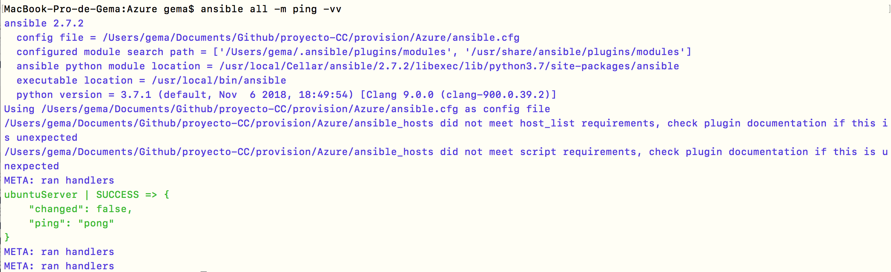

## Ansible+Azure para provisionar máquinas virtuales 

**Tabla de Contenidos**

- [Azure](#id1)
- [Ansible](#id21)
  - [Configuración básica _ansible.cfg_](#id2)
  - [Inventariando los hosts](#id3)
  - [Provisionando en Ansible](#id4)
-  [Desplegar la aplicación usando un playbook de Ansible](#id5)
  - [Proyecto en ejecución en Azure](#id6)
- [Enlaces interesantes](#id7)

[Microsoft Azure](https://azure.microsoft.com/es-es/) es una plataforma informática en la nube de nivel empresarial abierta y flexible. En la cual, tenemos la posibilidad crearnos máquinas virtuales en Azure Portal. Como se ha comentado antes, se va a escoger como SO Ubuntu 14.04.5 LTS. Para la creación de la máquina virtual, hemos seguido el siguiente [tutorial](https://docs.microsoft.com/es-es/azure/virtual-machines/linux/quick-create-portal?toc=%2fazure%2fvirtual-machines%2flinux%2ftoc.json). Obteniendo una mv con las siguientes prestaciones:

Debemos tener en cuenta, que la dirección IP pública por defecto es dinámica, es decir que cada vez que arranquemos la máquina virtual variará, es por eso que debemos poner la IP estática.

Una vez que ya tenemos nuestra máquina virtual, vamos a provisionarla usando Ansible, cuando veamos que funciona correctamente, ya podremos pasar a realizar el provisionamiento con Azure.

### Ansible 

#### Configuración básica _ansible.cfg_ 

Lo primero que tenemos que hacer es un fichero de configuración dentro de nuestro directorio. Este fichero hay que meterlo en el directorio donde estemos trabajando y básicamente le dice a Ansible que tiene que mirar en el fichero *ansible_hosts*.

~~~
[defaults]
host_key_checking = False
inventory = ./ansible_hosts
~~~

#### Inventariando los _hosts_ 

Cada máquina que se añada al control de ansible se tiene que añadir a un fichero, llamado inventario que contiene las diferentes máquinas máquinas controlados por el mismo. En el fichero **ansible_hosts** se le asigna un nombre a la máquina y se configura una serie de requerimientos: cuál es el puerto SSH para acceder a la máquina virtual que hemos creado (22), la dirección IP para acceder y el nombre de usuario. Además, para acceder a la máquina virtual necesitamos una clave privada ([ver tutorial](https://docs.microsoft.com/es-es/azure/virtual-machines/linux/quick-create-portal?toc=%2fazure%2fvirtual-machines%2flinux%2ftoc.json)), la cual estará en el directorio *~/.ssh/id_rsa*.

~~~
[azure]
ubuntuServer ansible_ssh_port=22 ansible_ssh_host=23.97.225.1

[azure:vars]
ansible_ssh_user=gemaAzure
ansible_ssh_private_key_file= ~/.ssh/id_rsa
~~~

Nuestro propósito con todo esto es comprobar si Ansible funciona. Para hacer una comprobación básica (debe estar arrancada la máquina virtual), hacemos un ping y vemos que tenemos acceso a ella:

~~~
$ ansible all -m ping
~~~

Esta orden hace un ping, es decir, simplemente comprueba si la máquina es accesible desde la máquina local. Si inluimos -u incluye el nombre del usuario (si es diferente del de la máquina local); habrá que añadir --ask-pass si no se ha configurado la máquina remota para poder acceder a ella sin clave.

~~~
ansible all -u gemaAzure -m ping
~~~

Si añadimos *-v*, _-vv_ o _-vvv_ obtendremos más información, en la conexión de Ansible por SSH.

~~~
$ ansible all -m ping -vv
~~~

#### Provisionando en Ansible 

Finalmente, el concepto similar a las recetas de Chef en Ansible son los [playbooks](https://davidwinter.me/introduction-to-ansible/), ficheros en YAML[1](#myfootnote1) que le dicen a la máquina virtual qué es lo que hay que instalar en tareas, de la forma siguiente

~~~
---
- hosts: all
  become: yes
  gather_facts: False
~~~

- Las tres líneas/rayas del principio indican que es un documento o página.
- `-` con el menos se indica que va a comenzar un array.
- `hosts: all` se indica que el hosts es para todas las máquinas virtuales que encuentre ansible, en este caso solo tenemos una.
- `become: yes` sirve para indicar si vamos a necesitar privilegios de superusuario para trabajar, y así poder instalar desde sudo.
- `gather_facts: False` para desactivar la recopilación de datos [[4][4]].
- `tasks` define las tareas que vamos hacer, es decir, el estado que tiene que alcanzar la máquina sobre la que vamos a trabajar.

~~~
- name: Instalar Python 2 para Ansible
  raw: test -e /usr/local/bin/python || (apt -y update && apt install -y python)
  changed_when: False

- name: Instalar Python 3 para Ansible
  raw: test -e /usr/local/bin/python3 || (apt -y update && apt install -y python3)
  changed_when: False

~~~

- `name: Instalar Python 2 para Ansible` comprueba que esté instalado Python2 y sino lo intala.
- `name: Instalar Python 3 para Ansible` comprueba que esté instalado Python2 y sino lo intala.

~~~
- name: Instala git
  apt: pkg=git state=present
~~~

- `name: Instala git` comprueba si está instalado git, en caso de no estarlo lo hace (alcanza el estado present si no lo está).

~~~
- name: Instalar pip3
  apt:
    package: python3-pip
    state: latest

- name: Instalar pip
  apt:
    package: python-pip
    state: latest
~~~

- `name: Instalar pip3` instala pip3 para python3.
- `name: Instalar pip` instala pip para python2.

~~~
- name: Clonar repositorio
  become: false
  git:
    repo: https://github.com/Gecofer/proyecto-CC.git
    dest: proyecto-CC
~~~

- `name: Clonar repositorio` clona el repositorio de mi proyecto en una carpeta

~~~
- name: Instalando dependencias del proyecto
  pip:
    requirements: /home/gemaAzure/proyecto-CC/requirements.txt
    executable: pip3
~~~

- `name: Instalando dependencias del proyecto` instala las dependencias necesarias para que el servicio arrance, en mi caso _Flask_ y _gunicorn_ ([ver requirements.txt](https://github.com/Gecofer/proyecto-CC/blob/master/requirements.txt)).

~~~
iptables -t nat -I PREROUTING -p tcp --dport 80 -j REDIRECT --to-ports 5000"
~~~

- `name: Redirigir puerto 5000 al 80` sentencia que nos permite redirigir el puerto 5000 (Flask) al 80, a recomendación del profesor. Para comprender esta sentencia [ver cómo redireccionar tráfico de una IP y puerto hacia otra IP y puerto](https://blog.desdelinux.net/redireccionar-trafico-iptables/).

Una vez nuestro fichero esté creado, debemos pasar a instalar dichos paquetes en nuestra máquina virtual.

### Desplegar la aplicación usando un playbook de Ansible  

A continuación, vamos desplegar nuestra aplicación que se haya usado anteriormente con todos los módulos necesarios usando un playbook de Ansible.

~~~
$ ansible-playbook -i ansible_hosts -b ansible_playbook.yml
~~~

Con la configuración a punto en nuestra mv de Azure, ya podemos desplegar la aplicación, pero antes deberemos conectarnos a ella mediante:

~~~
$ ssh gemaAzure@23.97.225.1
~~~

Lanzamos nuestra aplicación con [_gunicorn_](https://gunicorn.org) y efectivamente comprobamos que tenemos podemos aceder:

~~~
$ gunicorn -b :5000 main:app
~~~

~~~
$ curl http://23.97.225.1
{"status":"OK"}

$ curl http://23.97.225.1/status
{"status":"OK"}
~~~

~~~
$ curl http://23.97.225.1:80
{"status":"OK"}

$ curl http://23.97.225.1:80/status
{"status":"OK"}
~~~

#### Proyecto en ejecución en Azure 

Para comprobar que el proyecto está en ejecución, basta con acceder a [http://23.97.225.1/](http://23.97.225.1/) o [http://23.97.225.1/status](http://23.97.225.1/status) y comprobar que el resultado es parecido a las siguientes imágenes.

### Enlaces interesantes 

- [Redireccionar tráfico de una IP y puerto hacia otra IP y puerto](https://blog.desdelinux.net/redireccionar-trafico-iptables/)

<a name="myfootnote1">1</a>: Debemos hacer uso de un _playbook_, el cual usa un formato YAML. YAML es un formato de serialización parecido a JSON, pero este permite expresar todo tipo de estructuras de datos.
