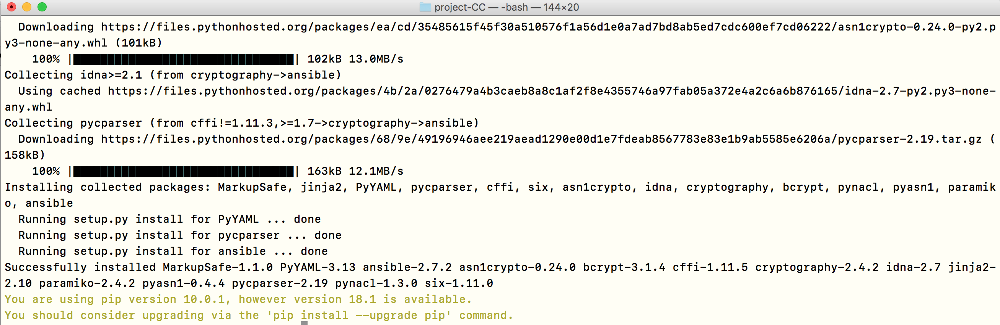

**Tabla de Contenidos**

- [Gestionando configuraciones con Ansible](#id1)
  - [¿Cómo instalar Ansible en MAC?](#id2)
  - [Comprobación de la instalación de Ansible](#id3)
- [Selección del SO](#id4)
- [Despliegue localmente (Vagrant) con Ansible](https://github.com/Gecofer/proyecto-CC/tree/master/provision/vagrant-ubuntu)
- [Despliegue en la máquina virtual de Azure con Ansible](https://github.com/Gecofer/proyecto-CC/tree/master/provision/Azure)

## Gestionando configuraciones con [Ansible](https://www.youtube.com/watch?v=gFd9aj78_SM) 

Vamos a [hacer uso de Ansible](https://semaphoreci.com/community/tutorials/introduction-to-ansible) al ser unos de los gestores de configuración de los que se está desarrollando con más intensidad últimamente. [Ansible es](https://en.wikipedia.org/wiki/Ansible_%28software%29) un sistema de gestión remota de configuración que permite gestionar simultáneamente miles de sistemas diferentes. Está basado en YAML para la descripción de los sistemas y escrito en Python. Es decir, es un gestor de configuración que trabaja sobre máquinas virtuales o reales ya creadas y en funcionamiento, describiendo o creando la configuración que necesitan para ejecutar una aplicación determinada. Además, proporciona infraestructura como código, permitiendo describir los sistemas en los que se va a ejecutar código como si de un programa se tratara, con todo lo que ello conlleva: control de código y testeo, por ejemplo [[1][1]]. Las recetas usadas por los gestores de configuraciones se ejecutan directamente si ya tenemos tal máquina provisionada con al menos un SO.

Para Python, el sistema de provisionamiento necesario es Ansible. En su instalación, a veces es necesario instalar algún paquete adicional. Por ejemplo, hace fala instalar `python-apt` si se quiere usar directamente las órdenes correspondientes de Ansible en vez de ejecutar otras órdenes. Cada imagen suele tener un usuario con privilegios de administrador configurado, por lo que hay que consultar en qué lugar está, y una vez hecho eso, el siguiente paso en el provisionamiento es crear un par de clave pública/privada y copiar la pública al objetivo.

Se instala como un módulo de Python, usando por ejemplo la utilidad de
instalación de módulos `pip` (que habrá que instalar si no se tiene). El resto de las utilidades son también necesarias y en realidad se instalan automáticamente al instalar ansible. Estas utilidades se tienen que instalar *en el anfitrión*, no hace falta instalarlas en el invitado, que lo único que necesitará, en principio, es tener activada la conexión por ssh y tener una cuenta válida y forma válida de acceder a ella.

#### ¿Cómo instalar Ansible en MAC? 

- [Latest Releases via Pip](https://docs.ansible.com/ansible/2.7/installation_guide/intro_installation.html#latest-releases-via-pip)
- [Install Ansible on Mac OSX](https://hvops.com/articles/ansible-mac-osx/)
- [How to install Ansible on Apple MacOS X using command line](https://www.cyberciti.biz/faq/how-to-install-ansible-on-apple-macos-x-using-command-line/)

~~~
# Install Ansible on MacOS
$ pip install ansible

Successfully installed MarkupSafe-1.1.0 PyYAML-3.13 ansible-2.7.2 asn1crypto-0.24.0
bcrypt-3.1.4 cffi-1.11.5 cryptography-2.4.2 idna-2.7 jinja2-2.10 paramiko-2.4.2
pyasn1-0.4.4 pycparser-2.19 pynacl-1.3.0 six-1.11.0
~~~

#### Comprobación de la instalación de Ansible 

~~~
# Comprobar que se ha instalado correctamente
$ ansible --version

ansible 2.7.2
  config file = None
  configured module search path = ['/Users/gema/.ansible/plugins/modules', '/usr/share/ansible/plugins/modules']
  ansible python module location = /Users/gema/.pyenv/versions/3.6.7/lib/python3.6/site-packages/ansible
  executable location = /Users/gema/.pyenv/versions/3.6.7/bin/ansible
  python version = 3.6.7 (default, Nov 27 2018, 11:01:02) [GCC 4.2.1 Compatible Apple LLVM 9.0.0 (clang-900.0.39.2)]
~~~

Ansible no requiere que haya nada instalado previamente en la máquina virtual. Primero vamos a trabajar con máquinas virtuales locales, para ello Ansible nos permite trabajar con ellas de forma simple, para acceder a las máquinas virtuales solo hace falta un acceso por SSH o por clave. Es por ello, que antes de hacer uso de Azure, vamos a trabajar con Vagrant de manera local.

### Selección del SO 

Una vez instalado Ansible o antes de empezar con la realización del despliegue, debemos escoger que SO vamos a usar, para ello debemos ver las funcionalidades que vamos a querer en el mismo. Es por ello que vamos a ver que servidor elegir entre Debian Server vs Ubuntu Server, los SO a escoger.

**¿Qué es Debian y qué es Ubuntu Server?**

Ambas son versiones diferentes del sistema operativo Linux (el término para esto son distribuciones, o distribuciones para abreviar). Ubuntu Server se basa en realidad en Debian, a través de los equipos que lo ejecutan son diferentes.

_Características de Debian_

- No ofrece actualizaciones tradicionales (donde reiniciaría el servidor para descargar e instalar la última actualización principal), sino un flujo de versiones a las que un sistema en directo puede actualizarse. Esto se puede hacer usando el administrador de paquetes apt-get, un programa que le permite instalar actualizaciones y software.

- Tiene la reputación de ser más estable.

- Tiene muchos paquetes preconfigurados (lo que significa que no necesitarán ser configurados para ejecutarse en su servidor).

_Características de Ubuntu_

- Ubuntu tiene versiones programadas, y LTS Builds. Un LTS build es una versión de la distribución que se ofrece soporte a largo plazo (LTS). Ubuntu soporta sus versiones de LTS por un máximo de 5 años. Debian ha ofrecido normalmente sólo 3 años de soporte para sus construcciones.

- Ofrece mayor soporte que Debian.

Debido a que cada sistema operativo es gratuito, se puede elegir en función de las funciones y el soporte que se necesite. Sin embargo, hemos optado por hacer uso de Ubuntu 14.04.5 LTS, al ser el Ubuntu con el más familiarizado estoy (viene con python3) y el [tutorial para instalar y usar Vagrant](https://fortinux.gitbooks.io/humble_tips/content/capitulo_1_usando_aplicaciones_en_linux/tutorial_instalar_vagrant_para_usar_ambientes_virtuales_en_gnulinux.html) con el que he probado localmente, es muy sencillo de entender.

### Despliegue localmente (Vagrant) con Ansible

Pincha [aquí](https://github.com/Gecofer/proyecto-CC/tree/master/provision/vagrant-ubuntu) para ver el proceso.

### Despliegue en la máquina virtual de Azure con Ansible

Pincha [aquí](https://github.com/Gecofer/proyecto-CC/tree/master/provision/Azure) para ver el proceso.

[1]: https://jj.github.io/CC/documentos/temas/Provision
[2]: http://www.servidorinfo.info/que-servidor-os-elegir-en-2018-debian-server-vs-ubuntu-server/
