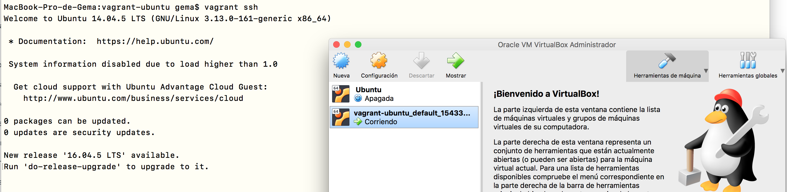

## Vagrant+Ansible para provisionar mv de manera local

[Vagrant](http://www.conasa.es/blog/vagrant-la-herramienta-para-crear-entornos-de-desarrollo-reproducibles/) es una herramienta gratuita de línea de comandos, disponible para Windows, MacOS X y GNU/Linux, que permite generar entornos de desarrollo reproducibles y compartibles de forma muy sencilla. Vagrant crea y configura máquinas virtuales a partir de simples ficheros de configuración. Para poder usar Vagrant previamente tendremos que tener instalado una herramienta de virtualización, entre las que destaco VMware Player y VirtualBox, aunque yo voy hacer uso de VirtualBox (pincha [aquí](https://www.virtualbox.org/wiki/Downloads) para descargar VirtualBox).

**¿Por qué hacer uso de VirtualBox y no de VMware?** VMware Player y VirtualBox son dos plataformas muy similares, sin embargo, la principal característica que separa a ambas herramientas de virtualización es que la plataforma VirtualBox es de código abierto, totalmente gratuita y está disponible para cualquier sistema operativo, cosa que no ocurre con VMware Player (software propietario). Es por ello, que he hecho uso de la instalación de VirtualBox [[1][1]].

Una vez instalada la heramienta, solo se tendrá que instalar Vagrant por línea de órdenes.

~~~
# Now install Vagrant either from the website or use homebrew for installing it
$ brew cask install vagrant
~~~


Como se ha comentado antes, se va a escoger como SO Ubuntu 14.04.5 LTS.

~~~
# Descargamos el SO Ubuntu 14.04:
$ vagrant box add ubuntu/trusty64 https://vagrantcloud.com/ubuntu/boxes/trusty64
~~~


Una vez que Vagrant está instalado y ya tenemos en nuestro ordenador las cajas (boxes), vamos a crear nuestra primera máquina virtual Ubuntu. Para ello, primero creamos un directorio para ella y nos movemos allí:

~~~
$ mkdir vagrant-ubuntu
$ cd vagrant-ubuntu/

# Creamos el archivo de configuración de vagrant
$ vagrant init
~~~


Editamos la línea `config.vm.box = "base"` por `config.vm.box = "ubuntu/trusty64"` de ese archivo, denominado Vagrantfile para que Vagrant busque el box de Ubuntu Trusty 64 que descargamos anteriormente, es decir, en ese fichero se definen las máquinas virtuales a usar. En nuestro caso, le estamos diciendo que queremos que use la máquina virtual con Ubuntu Trusty de 64 bits.

~~~
$ vim Vagrantfile

Vagrant.configure("2") do |config|
  config.vm.box = "ubuntu/trusty64"
end
~~~

Ahora, ya podemos iniciar la máquina virtual:

~~~
$ vagrant up
~~~


Y nos conectamos a ella por ssh:

~~~
$ vagrant ssh
~~~



~~~
# Para salir:
$ exit

# Para apagarla:
$ vagrant halt

# Para eliminar la máquina virtual:
$ vagrant destroy
~~~

Una vez que ya tenemos nuestra máquina virtual, vamos a provisionarla usando Ansible, cuando veamos que funciona correctamente, ya podremos pasar a realizar el provisionamiento con Azure.

_**Nota**: todos los archivos de Vagrant y Ansible tienen que estar en la misma carpeta_

**Configuración básica _ansible.cfg_**

Lo primero que tenemos que hacer es un fichero de configuración dentro de nuestro directorio. Este fichero hay que meterlo en el directorio donde estemos trabajando y básicamente le dice a Ansible que tiene que mirar en el fichero *ansible_hosts* (defino como se va a conectar Asnsible).

```
[defaults]
host_key_checking = False
inventory = ./ansible_hosts
```

**Inventariando los _hosts_**

En el fichero **ansible_hosts** se le asigna un nombre a la máquina y se configura una serie de requerimientos: cuál es el puerto SSH para acceder a la máquina virtual que hemos creado, por defecto es el 2222, y al host le estamos diciendo a la máquina que vamos acceder. Además, para acceder a la máquina virtual necesitamos una clave privada que suele estar en el directorio: *.vagrant/machines/default/virtualbox/private_key*. En general, estamos haciendo que Ansible se conecte correctamente con Vagrant mediante SSH.

```
[vagrantboxes]
ubuntuServer ansible_ssh_port=2222 ansible_ssh_host=127.0.0.1

[vagrantboxes:vars]
ansible_ssh_user=vagrant
ansible_ssh_private_key_file=.vagrant/machines/default/virtualbox/private_key
```

Ahora vamos hacer una comprobación básica (debe estar arrancada la máquina virtual), para ello hacemos un ping y vemos que tenemos acceso a ella:

```
$ ansible all -m ping
```


Si añadimos _-v_, _-vv_ o _-vvv_ obtendremos más información, en la conexión de Ansible con Vagrant por SSH.

```
$ ansible all -m ping -vv
```


**Provisionando en Ansible**


### Enlaces interesantes

- [Tutorial para instalar y usar Vagrant](https://fortinux.gitbooks.io/humble_tips/content/capitulo_1_usando_aplicaciones_en_linux/tutorial_instalar_vagrant_para_usar_ambientes_virtuales_en_gnulinux.html)


[1]: https://www.softzone.es/2017/03/14/comparativa-vmware-virtualbox/
